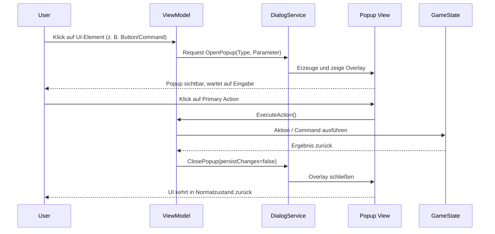
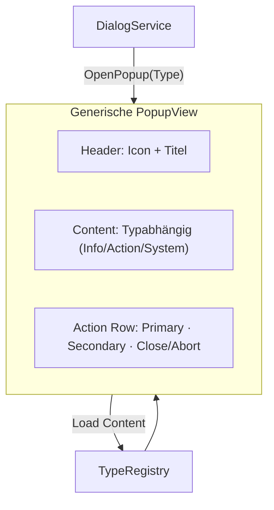
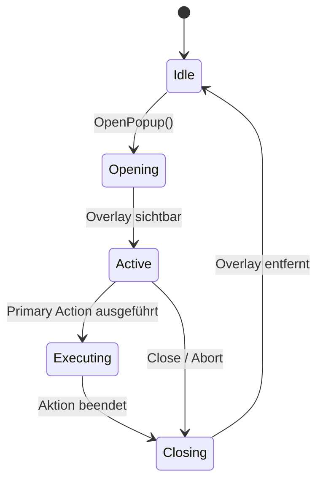

# Chaos Overlords – DialogService (Allgemeine Spezifikation)

Dieses Dokument beschreibt das allgemeine Konzept des **DialogService** für das Chaos Overlords-UI-System.  
Es dient als Grundlage für die Implementierung eines generischen Popup-Managers, der alle Dialoge und Overlays steuert, ohne deren inhaltliche Logik zu kennen.

---

## 1️⃣ Allgemeine Beschreibung

Der **DialogService** ist eine zentrale Komponente der Benutzeroberfläche.  
Er verwaltet das Öffnen, Anzeigen, Steuern und Schließen aller **Dialoge, Sheets und Overlays**.

Ziel ist es, die Anzeige- und Steuerlogik von der Spiellogik zu trennen.  
Der Service weiß **wie** ein Dialog angezeigt wird, aber nicht **was** darin passiert.

### Hauptaufgaben

- Öffnen und Anzeigen von Dialogen als Overlays  
- Weiterleiten von Benutzeraktionen (Execute, Close, Abort)  
- Verwaltung der Lebenszyklen (Lifecycle) aller aktiven Popups  
- Einheitliche Schnittstelle für alle UI-Komponenten  
- Steuerung von Animation, Theme, Fokus und Zustand  

### Lebenszyklus

```
Idle → Opening → Active → Executing → Closing → Idle
```

Jeder Dialog – unabhängig von seinem Typ – folgt dieser Abfolge.

---

## 2️⃣ Ablaufdiagramm

### Dialog-Lifecycle: Öffnen, Execute, Schließen



---

## 3️⃣ Parameterbeschreibung

Beim Öffnen eines Dialogs werden Parameter an den DialogService übergeben.  
Diese bestimmen Typ, Inhalt und Verhalten des anzuzeigenden Overlays.

| Parameter | Typ | Beschreibung |
|------------|-----|--------------|
| **Type** | String / Enum | Identifiziert die Art des Dialogs (z. B. "Info", "Action", "System"). |
| **Parameter** | Objekt (optional) | Daten, die im Dialog angezeigt oder verändert werden. |
| **PersistChanges** | Bool | Beim Schließen: ob Änderungen gespeichert werden. |
| **Callback** | Funktion (optional) | Wird nach Abschluss oder Schließen aufgerufen. |
| **Theme / Style** | Enum | Bestimmt Farb- oder Layout-Variante des Overlays. |

Der DialogService wertet diese Parameter nicht fachlich aus;  
er übergibt sie an die konkrete View-Instanz.

---

## 4️⃣ Dynamischer Inhalt nach Typ

Der DialogService erzeugt Popups immer mit derselben äußeren Struktur,  
füllt jedoch den mittleren **Content-Bereich** dynamisch anhand des Typs.

### Ablauf

1. **ViewModel** sendet: `OpenPopup(type="Action", parameter={...})`
2. **DialogService** prüft Typ und fragt über eine Factory oder Registry die zugehörige Layout-Vorlage ab.  
3. Die Factory erzeugt eine generische **PopupView** mit:
   - Header (Titel, Icon)
   - Content-Area (durch Typ bestimmt)
   - Action-Row (Buttons)
4. Der **Content-Bereich** wird dynamisch befüllt:
   - *Info* → statische Anzeige, scrollfähig  
   - *Action* → interaktive Eingaben, Auswahlfelder  
   - *System* → Einstellungen oder Bestätigungen  
5. Der DialogService blendet das Popup als Overlay ein.

### Strukturübersicht



---


### Layout-Regeln
- **Header:** immer sichtbar, kein Close-(X)-Button  
- **Content:** scrollbar, max. 70 % der Bildschirmhöhe  
- **Action Row:** drei Buttons in fixer Reihenfolge  
- **Ausrichtung:** zentriert, Overlay über Haupt-UI  
- **Farbcode:** wird durch Popup-Typ bestimmt  

---

## 6️⃣ Verhalten der Popup-Typen

### 🟠 Informations-Popups (*Type = Info*)

**Zweck:**  
Anzeige von Daten, Status oder Logs. Keine Benutzereingaben.

**Verhalten:**  
- Nur Lesemodus, keine Datenänderung  
- Primary Button kann „Export“ oder „Mark as Read“ auslösen  
- Close-Button beendet das Overlay  
- Keine Persistenz notwendig  

---

### 🔵 Aktions-Popups (*Type = Action*)

**Zweck:**  
Ausführen von spielrelevanten Aktionen (z. B. Angriff, Forschung, Kauf).

**Verhalten:**  
- Nutzer wählt Parameter oder Ziel  
- Klick auf Primary → führt Aktion aus  
- Nach Erfolg automatisches Schließen  
- Close oder Abort → keine Auswirkung  
- GameState wird nur bei Erfolg aktualisiert  

---

### ⚙️ System-Popups (*Type = System*)

**Zweck:**  
Globale Einstellungen, Bestätigungen, Fehlermeldungen.

**Verhalten:**  
- Änderungen wirken auf Spielumgebung (nicht Gameplay)  
- Primary führt z. B. „Save“ oder „Confirm“ aus  
- Close/Abort verwirft Änderungen  
- Persistenz nur bei `persistChanges = true`  

---

## 🧠 Zustandsmaschine (Lifecycle)



**Beschreibung:**
- **Idle:** kein Popup aktiv  
- **Opening:** Dialog wird erzeugt und angezeigt  
- **Active:** Benutzer kann interagieren  
- **Executing:** Aktion läuft  
- **Closing:** Popup wird ausgeblendet, Rückkehr zu Idle  

---

## Zusammenfassung

- Der **DialogService** steuert Öffnen, Ausführen und Schließen sämtlicher Dialoge.  
- Jeder Dialog besitzt identische Struktur – Header, Content, Action Row.  
- Der **Content** wird abhängig vom Typ dynamisch geladen.  
- Der Service ist **agnostisch gegenüber Spiellogik** – er zeigt nur UI, keine Entscheidungen.  
- Lebenszyklus und Verhalten sind standardisiert und erweiterbar.  
- Basis für alle zukünftigen Popup- und Sheet-Implementierungen im Chaos Overlords-UI.

---

© 2025 Chaos Overlords UI/UX – DialogService Specification (General)
