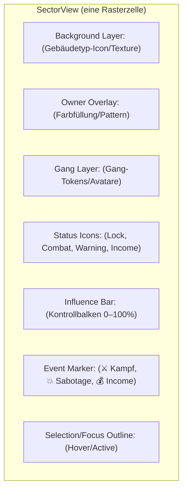
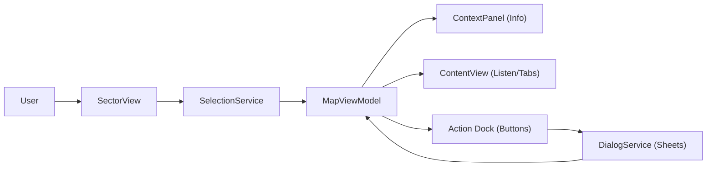

# Chaos Overlords – SectorView Specification (Windows Desktop)
> **Wichtiges Update:** In diesem Dokument wird **SectorView** als **einzelne Karten-Zelle** definiert.  
> Eine gesonderte, gruppierte „Sektor“-Darstellung existiert **nicht** mehr.  
> Der zuvor verwendete Begriff **CellView** entspricht jetzt **SectorView** (1:1, gleicher Zweck).

---

## 1) Definition & Geltungsbereich
- **SectorView (vormals CellView):** Visuelle und interaktive Darstellung **einer** Karte **Zelle** (Site/Gebäude) innerhalb des MapView-Rasters.
- **Nur Windows Desktop (Landscape).**
- Keine modalen Fenster, keine Kontextmenüs: Aktionen starten über **Action Dock** (unten) und werden in **Sheets/Overlays** ausgeführt.

---

## 2) Aufgaben des SectorView
- Status der Site anzeigen: **Owner**, **Influence**, **Defenses**, **Income**, **Events**.
- Vorhandene **Gangs** visualisieren (eigene/fremde, im Kampf/stationiert).
- **Selektion** ermöglichen (einzeln, multi mit Strg-Klick).
- **Feedback** zu temporären Zuständen (z. B. „Contested“, „Locked“, „Sabotaged“).
- Trigger für **ContextPanel**/**ContentView**-Updates (rechts) und Aktivierung von **Action Dock**-Buttons (unten).

---

## 3) Visueller Aufbau (Layer)

**Reihenfolge (unten → oben):** `BG → OW → GT → ST → IF → EV → HL`

---

## 4) Angezeigte Daten (pro Zelle)
| Kategorie | Felder (Beispiele) |
|---|---|
| **Site** | Name/ID, Typ (Factory/Office/Slum/Market/Lab), Koordinaten |
| **Owner/Control** | Besitzer (Con/Neutral), **Influence %**, Disputed/Contested |
| **Defenses** | Sicherheitslevel, stationierte Wachen, Boni/Mali |
| **Economy** | Income/Output, Blocked (durch Sabotage) |
| **Units** | Eigene/fremde Gangs, Stärke, Ausrüstungssignale |
| **Events** | Letzte Aktionen vor Ort (Kampf, Sabotage, Transfer) |

---

## 5) Statusanzeigen & Badges
| Icon/Badge | Bedeutung | Darstellung/Regel |
|---|---|---|
| **Owner Color** | Zugehörigkeit | Overlay-Farbe (50 % Opacity) in Con-Farbe |
| **Influence Bar** | Kontrollgrad | Single-Bar, Farbverlauf in Owner-Farbe, 0–100 % |
| **⚔️ Combat** | Umkämpft | Pulsierender Rahmen + Icon oben rechts |
| **🔒 Locked** | Blockiert/Cooldown | Grauer Sperr-Overlay + Badge |
| **🔥 Sabotaged** | Wirtschaft/Defenses reduziert | Rauch/Leuchten + Warnbadge |
| **👁 Fog** | Keine Sicht | Dunkler Filter, keine Detail-Icons |
| **⚠ Warning** | Niedrige Defenses/Bedrohung | Gelbes Dreieck, Tooltip erklärt Ursache |

> Tooltips liefern Detailwerte (z. B. „Defenses: 3 (−1 Sabotage)“).

---

## 6) Interaktionen (Desktop)
| Eingabe | Verhalten | Ergebnis |
|---|---|---|
| **Linksklick** | Zelle selektieren | ContextPanel → „Detail“, ContentView → Tab gemäß Kontext, Action Dock kontextualisiert |
| **Strg+Klick** | Multi-Select | Mehrere Sektoren markieren → Bulk-Aktionen (falls vorgesehen) |
| **Doppelklick** | Fokus/Zoom auf Zelle | MapView zoomt leicht ein; Rechts-Panel bleibt sichtbar |
| **Hover** | Tooltip | Kurzinformationen (Owner, Income, Defenses, Events) |
| **Rechtsklick** | **Deaktiviert** | Keine Kontextmenüs im neuen Konzept |
| **Tastatur** | Pfeile zum Bewegen (optional), **Esc**: Auswahl aufheben | Map-Navigation/Selektion |

**Aktionen** werden nicht direkt aus der Zelle gestartet, sondern über **Action Dock** (z. B. *Attack*, *Influence*, *Move*).

---

## 7) Daten‑ & Ereignisfluss

- **SelectionService** zentralisiert die aktive Zelle(n).  
- **MapViewModel** lädt Details/Listen und aktiviert passende Dock-Aktionen.  
- **DialogService** öffnet Sheets; nach Execute aktualisiert MVM Sektorstatus/Badges.

---

## 8) Rendering‑Regeln & Performance
- Ziel: **60 FPS** bei Pan/Zoom/Highlight.  
- **Tilegröße**: 48–96 px (skalierend), **Hitbox** = volle Zelle.  
- **Pooling** für Gang-Tokens & Badges, **virtualized draw** bei hohem Zoom-Out.  
- **Farben**/Kontraste WCAG‑konform; Hover/Focus klar sichtbar.  
- **Labeling**: Kurznamen/Icons, Text nur bei ausreichendem Zoom-Level einblenden.

---

## 9) Accessibility
- Fokus-Ring auf selektierter Zelle; Screenreader-Announce: „Sector A3, owned by X, Influence 62 %, Contested“.
- Tastatur-Selektion (Tab/Pfeile) optional; **Esc** hebt Auswahl auf.
- Tooltips mit aussagekräftigen Beschreibungen, keine alleinige Farbkommunikation.

---

## 10) Kompatibilität & Migration (Änderungen)
- **Begriffe vereinheitlicht:** *CellView* → **SectorView** (einzelne Zelle).  
- **Entfernt:** „SectorView als Gruppierung mehrerer Zellen“.  
- **Dokumente/Diagramme**: künftige Verweise bitte auf **SectorView (Zelle)** angleichen.  
- **Interaktionen** bleiben unverändert (Click→Info→Action via Dock).

---

## 11) Zusammenfassung
- **SectorView = Zelle**: eine Site-Instanz mit Status, Badges, Gangs, Events.  
- Startpunkt für Kontextinformationen (rechts) und Aktionen (unten).  
- Kein Rechtsklick, keine Modals; Sheets via **DialogService**.  
- Performant, barrierearm, konsistent mit TopBar/MapView/ContentView.

---

© 2025 Chaos Overlords UI/UX – SectorView (Single‑Cell) Specification
