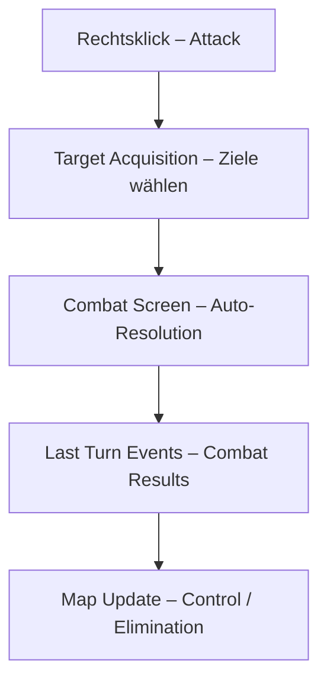

# chaosoverlord.uiux.combat.md

## 📌 Thema: Combat (Angriffe, Kämpfe, Auswertung)

---

## 1) Beobachtungen aus den Screenshots

### 1.1 Target Acquisition
- Popup „TARGET ACQUISITION“ zeigt gegnerische Gangs als Ziele.
- Auswahl → OK führt in Combat-Screen.

### 1.2 Combat Screen
- Spieler links, Gegner rechts; Portraits, Item-Slots, Force-Balken.
- Symbole für Skills (Fist, Blade, Gun …).
- Interaktion: OK/Cancel; Kampf wird automatisiert aufgelöst.

### 1.3 Last Turn Events – Combat
- Popups wie „Overlord Eliminated“, „Sector Control Attained“ etc.
- Kein detailliertes Kampflog, nur Summaries.

---

## 2) Abgleich mit Manual

- **Attack** über Kontextmenü; Abhandlung in **Combat Phase** der Runde.
- **Berechnung:** Combat/Defense/Skills + Items + Modifikatoren.
- **Outcomes:** Force-Verlust, Elimination bei 0; Items können verloren gehen.
- **Folgen:** Control/Chaos-Interaktionen in späteren Phasen.

---

## 3) Unstimmigkeiten UI ↔ Manual

1) **Eingabeweg**
- Manual fokussiert **Command Bar**; UI nutzt **Kontextmenü**.
2) **Transparenz**
- Manual beschreibt Reihenfolgen/Modifikatoren; UI zeigt keinen Ablauf.
3) **Feedback**
- UI liefert nach Kampf nur Schlagzeilen, keine Zahlen/Begründungen.

---

## 4) UX-Kommentare
- **Passiver Kampf:** keine taktische Eingabe während der Auflösung.
- **Black-Box-Effekt:** Warum-Sicht fehlt.
- **Viele Klicks** (Ziel → Kampf → Event) bei geringer Interaktion.

---

## 5) Lösungsvorschläge (Redesign)

1) **Combat Log** (Rundenweise, Treffer, Mods, Force-Delta).
2) **Delta-Visualisierung** vor Start (Your Force vs Enemy Force, Item/Skill-Hervorhebung).
3) **Einheitlicher Zugang** (Command Bar und Kontextmenü synchron).
4) **Konsequenzen sichtbar** (Map-Highlight, gewonnene/verl. Sites).

---

## 6) Skizze (Mermaid)

