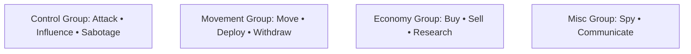
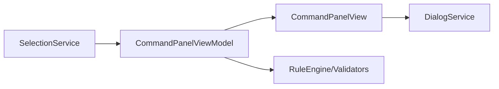

# Chaos Overlords – CommandPanel Specification (Windows Desktop)

Das **CommandPanel** (rechte Seitenleiste – unterer Bereich) zeigt **kontextabhängige Aktionen** zur aktuellen Auswahl an und ist die Brücke zum **Action Dock** (unten) und zum **DialogService** (Sheets).

---

## 1) Zweck
- **Handlungsableitung** aus der Auswahl (Sector/Gang/Item).
- **Aktionsfreigabe/-sperre** auf Basis von Regeln/Validierungen.
- **Startpunkt** für Sheets/Overlays (keine Modals, keine Rechtsklickmenüs).

---

## 2) Aufbau & Layout
- Position: **rechts**, direkt unter dem ContextPanel (gemeinsame Leiste).
- Inhalte: **Action‑Groups** (z. B. Kontrolle, Bewegung, Wirtschaft).
- Darstellung: **Buttons mit Icon+Label**, Inline‑Hinweise bei Deaktivierung.

---

## 3) Aktionen & Regeln (Beispiele)
| Aktion | Voraussetzung (enable) | Ergebnis (Primary) |
|---|---|---|
| **Attack** | Eigene Gang ausgewählt **und** Ziel feindlich | Öffnet `AttackSheet` (Execute → Event/InlineCombat) |
| **Influence** | Site sichtbar **und** Ressourcen vorhanden | `InfluenceSheet` |
| **Sabotage** | Gadget vorhanden **oder** Fähigkeit | `SabotageSheet` (Feature‑Slot) |
| **Move** | Eigene Gang ausgewählt | `MoveSheet` |
| **Deploy** | Site frei **und** Gang verfügbar | `DeploySheet` |
| **Withdraw** | Eigene Gang vor Ort | Sofort‑Aktion oder `WithdrawSheet` |
| **Buy/Sell** | Site hat Market/Lager | `PurchaseSheet` / `SellSheet` |
| **Research** | Site hat Lab **oder** globaler Slot | `ResearchSheet` |
| **Spy** | Ressourcen vorhanden | `IntelSheet` |
| **Communicate** | Neutrale Fraktion vor Ort | `DiplomacySheet` |

**Deaktivierungsgründe** (Tooltip): keine Sicht, fehlende Ressourcen, Cooldown, falsche Einheit/Ziel, Neutralgebiet, Feature gesperrt.

---

## 4) Interaktionen
- Klick auf Button → DialogService `OpenPopup(SheetType, payload)`
- Hover → Tooltip (Kosten, Voraussetzungen, erwartete Wirkung)
- Sekundäraktionen („…“) pro Gruppe (z. B. Filter/Presets)
- Tastatur: **1–6** Trigger im Action Dock spiegeln wichtige Buttons im CommandPanel.

---

## 5) Datenfluss & Validierung

- *SelectionService* liefert Kontext (Sector/Gang/Item).
- *RuleEngine* berechnet `IsEnabled`, `Reason`, `CostPreview`.
- *DialogService* öffnet das passende Sheet und meldet nach Execute zurück → Refresh.

---

## 6) Zustände
| Zustand | Darstellung |
|---|---|
| Disabled | Button inaktiv + Tooltip „Warum“ |
| Busy | Inline‑Spinner beim Execute |
| Error | Banner in Gruppe (z. B. „Ziel nicht erreichbar“) |
| Empty | „Keine Aktionen verfügbar“ (z. B. Fremdgebiet, keine Sicht) |

---

## 7) Implementierungsartefakte (Bezeichner)
- **View:** `CO.CommandPanelView`
- **VM:** `CO.CommandPanelViewModel`
- **Rule Engine:** `CO.ActionRuleEngine`
- **Action IDs:** `Attack`, `Influence`, `Move`, `Deploy`, `Withdraw`, `Buy`, `Sell`, `Research`, `Spy`, `Communicate`
- **Events:** `CommandPanel.ActionInvoked(actionId, payload)`

---

© 2025 Chaos Overlords UI/UX – CommandPanel Specification
