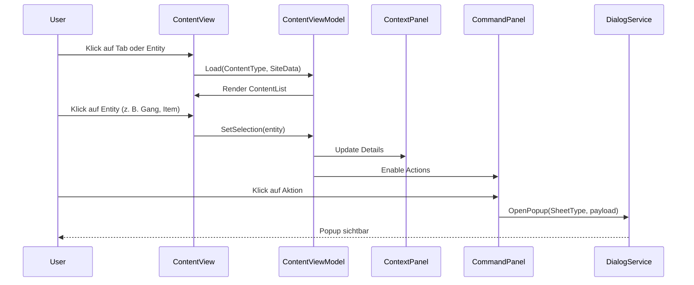

# Chaos Overlords – ContentView Matrix (Darstellung • Aktionen • Views)

Diese Matrix definiert die **Content-Typen** und deren Verhalten innerhalb des ContentView.  
Jeder Content-Typ wird über einen **Tab** dargestellt, besitzt eigene Datenfelder, Interaktionen und zulässige Aktionen.  
Alle ContentViews folgen demselben Grundschema:

> **Header → Tabs → Content Area → Inline Toolbar → Action Integration**

---

## 🧩 Allgemeine Regeln

- **ContentTypes:** `Gangs`, `Items`, `SiteLog`, `Relations`, `Effects`, `Economy`, `Production`, `Security`, `Intel`, `Population`  
- Jeder Typ ist ein eigener **ContentViewModel** und rendert über dieselbe Host-Komponente `ContentView`.  
- Aktionen im ContentView öffnen **Popups/Sheets** über den `DialogService`.  
- Jede Card/List-Row unterstützt **Single-** und **Multi-Selection**.  
- Filter, Sortierung und Suche sind **global persistent pro Typ**.

---

## 📊 Content Matrix

| ID | ContentType | Beschreibung | Hauptdatenfelder | Hauptaktionen | Bulk-Aktionen | View-Komponente | Besonderheiten / Interaktionen |
|----|---------------|---------------|------------------|----------------|----------------|------------------|-------------------------------|
| **C1** | Gangs | Darstellung aller Gangs an/um eine Site | Name, Status, Stärke, Ausrüstung, Ziel, Eigentümer | **Primary:** Attack / Move / Give Item   **Secondary:** Details / Withdraw | Group Move, Group Attack, Group Assign | `GangListView` / `GangCardView` | Klick = Auswahl, Doppelklick = Detailinfo im ContextPanel, LongPress = Multi-Select |
| **C2** | Items | Darstellung von Items im Besitz der Site oder gelagerter Gangs | Name, Kategorie, Zustand, Menge, Wirkung, Besitzer | **Primary:** Give / Use / Sell   **Secondary:** Move / Transfer | Bulk Give, Bulk Sell, Bulk Transfer | `ItemListView` / `ItemCardView` | Drag&Drop zwischen Gangs und Sites aktiv; Tooltip für Item-Beschreibung |
| **C3** | SiteLog | Chronologische Liste von Ereignissen auf der Site | Datum, Typ, Quelle, Beschreibung | **Primary:** Filter / Export   **Secondary:** Pin to Events | Delete Filter, Clear Log (Admin Mode) | `SiteLogView` | Scrollbare Timeline, Farbcode nach Event-Typ, Filter & Zeitraum-Auswahl |
| **C4** | Relations | Übersicht lokaler Fraktionen und deren Einfluss | Fraktion, Beziehung, Einflusswert, Status | **Primary:** Propose Truce / Pay Tribute   **Secondary:** Send Message | Bulk Diplomacy (mehrere Fraktionen) | `RelationsView` | Interaktive Heatmap, Klick = öffnet Diplomatie-Sheet, Werte dynamisch |
| **C5** | Effects | Aktive Boni / Mali auf Site oder Entities | Effektname, Typ, Dauer, Quelle, Intensität | **Primary:** Show Origin / Remove (Admin) | Remove Multiple (Debug/Admin) | `EffectsView` | Tooltip zeigt Ursprung (Gang, Item, Ereignis), Zeitbalken für Dauer |
| **C6** | Economy | Einnahmen, Ausgaben, Handelsübersicht (wenn Site Markt) | Einnahmen, Ausgaben, Net Income, Trends | **Primary:** Buy / Sell   **Secondary:** Export | Bulk Sell, Auto-Sell Toggle | `EconomyView` | Mini-Chart-Widget, kontextabhängig (nur bei Markets) |
| **C7** | Production | Darstellung von Produktionsstätten und Fortschritt | Projekt, Fortschritt %, verbleibende Zeit | **Primary:** Rush / Cancel   **Secondary:** Queue New | Bulk Cancel, Priority Set | `ProductionView` | Fortschrittsbalken, Timer, Hover-Details, Interaktiv |
| **C8** | Security | Verteidigungsstatus und Wachen | Einheit, Typ, Stärke, Kosten | **Primary:** Upgrade / Reassign   **Secondary:** Dismiss | Bulk Upgrade | `SecurityView` | Anzeige in Leveln, Farben nach Zustand (grün/gelb/rot) |
| **C9** | Intel | Aufklärung, Spionageinformationen | Ziel, Sichtbarkeitsgrad, Entdecker, Dauer | **Primary:** Investigate / Share Intel | Bulk Share | `IntelView` | Unscharfe Darstellung bei unvollständiger Sicht, Reveal Animation |
| **C10** | Population | Bewohner und Loyalität (späteres Feature) | Bevölkerung, Stimmung, Loyalität, Zufriedenheit | **Primary:** Influence / Propaganda | Bulk Influence | `PopulationView` | Nur Anzeige; spätere Integration für Propaganda-Aktionen |

---

## ⚙️ Zustände pro ContentType

| Typ | Loading | Empty | Error | Filtered |
|------|----------|--------|--------|----------|
| **Gangs** | Placeholder Cards (3–6) | „Keine Gangs verfügbar“ | Retry Button | Zeigt nur eigene oder verbündete Gangs |
| **Items** | Placeholder Cards | „Kein Item gefunden“ | Retry | Filter nach Kategorie (Waffe, Gadget, etc.) |
| **SiteLog** | Progress Spinner | „Keine Aktivitäten“ | Retry | Filter nach Typ und Zeitraum |
| **Relations** | Spinner + Heatmap Placeholder | „Keine bekannten Fraktionen“ | Retry | Nach Einflusswert sortierbar |
| **Effects** | Placeholder List | „Keine aktiven Effekte“ | Retry | Zeigt Dauerindikatoren |
| **Economy** | Progress Chart | „Keine Daten“ | Retry | Zeigt letzte 5 Runden |
| **Production** | Progress Bars | „Keine Produktion aktiv“ | Retry | Queue = leer |
| **Security** | Spinner | „Keine Verteidigung“ | Retry | Zeigt Sicherheitswarnung |
| **Intel** | Spinner | „Keine Daten“ | Retry | Teilweise verdeckte Infos |
| **Population** | Spinner | „Keine Einwohnerdaten“ | Retry | Nur Info |

---

## 🔁 Ereignisfluss (generisch)

---

## 🧩 ContentView → DialogService Zuordnung (Aktionen öffnen Popups)

| ContentType | Aktion | Ziel-Popup / Sheet |
|--------------|--------|--------------------|
| Gangs | Attack | `AttackSheet` |
| Gangs | Move | `MoveSheet` |
| Gangs | Give Item | `GiveSheet` |
| Items | Sell | `SellSheet` |
| Items | Buy | `PurchaseSheet` |
| Items | Research | `ResearchSheet` |
| Relations | Propose Truce | `DiplomacySheet` |
| Economy | Buy / Sell | `PurchaseSheet` / `SellSheet` |
| Production | Rush / Cancel | `ProductionSheet` |
| Security | Upgrade / Dismiss | `SecuritySheet` |
| Intel | Investigate | `IntelSheet` |
| Population | Influence | `InfluenceSheet` |

---

## 🔧 Einheitliche Interaktionsrichtlinien

- **Klick** auf Card = Auswahl + Info im ContextPanel  
- **Doppelklick / Long-Press** = direkte Aktion oder Details öffnen  
- **Bulk-Selektion** (Strg / Shift / Touch Hold) erlaubt Sammelaktionen  
- **Filter & Sort** bleiben pro Tab persistent (User-Session)  
- **Kein Modalverhalten:** Alle Aktionen über Popupsheets (DialogService)

---

## ✅ Zusammenfassung

- Jede ContentView-Instanz zeigt **eine Entitäten-Kategorie** (Gangs, Items, Logs, …).  
- Aktionen sind **kontextsensitiv** und über den DialogService angebunden.  
- Die ContentMatrix ist Grundlage für die Implementierung der ContentViewModel-Klassen und der jeweiligen UI-Komponenten (`*View`).  
- Einheitliche **Header-, Tab-, Filter- und Action-Struktur** für alle Typen.  
- Unterstützt **Single-, Multi- und Bulk-Interaktion**, **Drag&Drop** und **Touch-Optimierung**.  

---

© 2025 Chaos Overlords UI/UX – ContentView Matrix Specification
