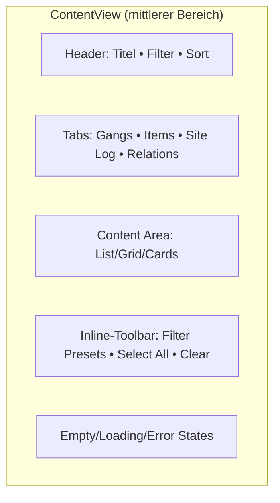
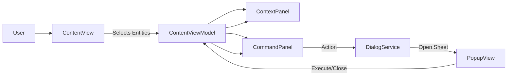
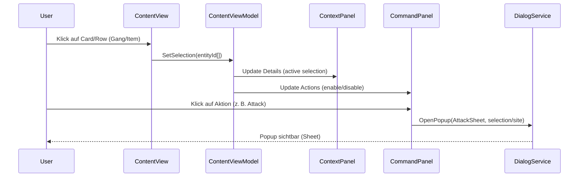

# Chaos Overlords – ContentView Specification

Der **ContentView** ist der mittlere Informations- und Interaktionsbereich der Hauptansicht.
Er ergänzt den MapView, indem er **konkrete, auswählbare Inhalte** zur aktuell markierten Zelle (Site) anbietet:
z. B. **Gangs vor Ort / verfügbar**, **Items**, **Site-Log**, **Beziehungen** oder **Konfliktstatus**.
Der ContentView arbeitet eng mit dem **ContextPanel** (Info) und dem **CommandPanel** (Aktionen) auf der rechten Seite zusammen.

---

## 🧩 1️⃣ Aufbau des ContentView

### Ziel

- **Schnelle Übersicht** über alle relevanten Entitäten zur selektierten Zelle
- **Direkte Auswahl** (Single-/Multi-Select) für anschließende Aktionen
- **Kompakte Darstellung** mit sortier-/filterbaren Listen oder Karten („Cards“)

### Hauptkomponenten

| Bereich                  | Beschreibung                                                                             |
| ------------------------ | ---------------------------------------------------------------------------------------- |
| **Header**         | Titel, Kurzinfo zur Quelle (z. B. „Gangs @ Site A3“) und optional Filter-/Sortleisten |
| **Tabs**           | „Gangs“, „Items“, „Site Log“, „Relations“, optional „Effects“                  |
| **Content Area**   | Listen-/Karten-Ansicht der gerade aktiven Tab-Inhalte                                    |
| **Inline-Toolbar** | Kontextbezogene Schnellbefehle (z. B. Filter Presets, Bulk-Select, Clear)               |
| **Empty State**    | Leere-/Fehlerzustände mit Handlungsanweisung (CTAs)                                     |

### Logische Struktur

---

## 🖱️ 2️⃣ Interaktionen (allgemein)

| Interaktion                     | Verhalten                                       | Ergebnis                                                                                  |
| ------------------------------- | ----------------------------------------------- | ----------------------------------------------------------------------------------------- |
| **Tab-Wechsel**           | Benutzer wählt Tab (Gangs/Items/Log/Relations) | Content Area lädt passenden Datensatz                                                    |
| **Auswahl (Karte/Zeile)** | Single-Select per Klick/Touch                   | Auswahl wird hervorgehoben, ContextPanel zeigt Detailinfo, CommandPanel passt Aktionen an |
| **Mehrfachauswahl**       | Strg/Shift-Klick (Desktop) / Long-Press (Touch) | Mehrere Einträge gewählt → Bulk-Aktionen freigeben                                     |
| **Drag & Drop**           | Items → Gang / Gang → Site                    | Vorschau + erlaubte Drop-Zonen, bei Drop: Aktion vorschlagen (Sheet öffnen)              |
| **Filter/Sort**           | Auswahl aus Header-Leiste                       | Content wird gefiltert/sortiert, Einstellungen bleiben pro Tab erhalten                   |
| **Suche**                 | Freitextsuche im Header                         | Reduziert Liste auf Treffer (Name/Tag/Attribut)                                           |
| **Clear**                 | Klick auf „Clear Selections/Filters“          | Selektionen und Filter werden zurückgesetzt                                              |
| **Scroll/Infinite**       | Liste wird virtualisiert                        | Performance bei großen Datenmengen                                                       |

**Touch-Optimierung:** Karten/Kacheln sind großflächig klickbar; Long-Press öffnet Mehrfachauswahlmodus.

---

## 🧭 3️⃣ Tab „Gangs“ – Darstellung & Inhalte

### Datenpunkte pro Gang (Card/Row)

- **Name** / **Icon / Farbe** der Gang
- **Status**: aktiv, verletzt, erschöpft, im Kampf
- **Stärke / Level / Erfahrung**
- **Ausrüstung/Loadout**: Primär-, Sekundär-Items (Kurzliste mit Tooltips)
- **Ort**: aktuelle Zelle, Ziel (falls unterwegs), Ankunftszeit
- **Eigentümer/Alignment** (falls relevant)
- **Kosten / Upkeep** (optional als Badge)

### Aktionen (Schnellbefehle auf Card)

- **Select** (Toggle)
- **Details** (öffnet GangDetails im ContextPanel oder separates Popup)
- **Move** (öffnet `MoveSheet`)
- **Attack** (öffnet `AttackSheet`, wenn Ziel vorhanden/zulässig)
- **Give/Use Item** (öffnet `GiveSheet` / Item-Picker)
- **Withdraw/Deploy** (wenn Site dies unterstützt)

### Bulk-Aktionen (bei Mehrfachauswahl)

- **Group Move**, **Group Attack**, **Group Assign/Withdraw**

### Zustände

- **Leer:** „Keine Gangs verfügbar“ (CTA: „Hire“ oder „Move here“)
- **Gesperrt:** „Fremde Site – keine Interaktion möglich“ (Lesemodus)
- **Konflikt:** Badge „Umkämpft“, Aktionsset reduziert (nur defensive/Exit)

---

## 📦 4️⃣ Tab „Items“ – Darstellung & Inhalte

### Datenpunkte pro Item

- **Name**, **Kategorie** (Waffe, Schutz, Gadget, Consumable)
- **Zustand** / Haltbarkeit (falls relevant)
- **Wirkung** (Kurztext + Tooltip für Details)
- **Menge** / Stack
- **Besitzer** (Lager/Gang)
- **Handel**: Kauf-/Verkaufspreis (falls zutreffend)

### Aktionen (Card/Row)

- **Select**
- **Give to Gang** (öffnet `GiveSheet` mit Zielgang)
- **Use** (direkte Anwendung oder Sheet, je nach Item)
- **Sell/Buy** (öffnet `SellSheet` / `PurchaseSheet`)
- **Move to Warehouse/Site** (logistische Verschiebung)

### Bulk-Aktionen

- **Sell Multiple**, **Transfer Multiple**, **Assign Multiple**

### Zustände

- **Leer:** „Keine Items verfügbar“ (CTA: „Buy“, „Research“, „Loot“)

---

## 📝 5️⃣ Tab „Site Log“ – Darstellung & Inhalte

- Chronologische Liste der **Ereignisse** an dieser Site (Ankunft/Abgang, Kämpfe, Einfluss, Sabotage, Einnahmen)
- **Filter** nach Ereignistyp (Kampf, Wirtschaft, Bewegung, System)
- **Zeitraum**-Filter (letzte X Runden)
- Aktion: **Export** (CSV/JSON) oder **Pin to Events** (zusammenfassung im Footer)

Zustände: **Leer** (keine Aktivitäten), **Gefiltert leer**, **Fehler beim Laden** (Retry möglich).

---

## 🤝 6️⃣ Tab „Relations“ – Darstellung & Inhalte

- **Beziehungen** vor Ort: Gangs/Faktionen, Kontrolle, diplomatische Haltung
- **Einflussmatrix** (kleine Heatmap oder Liste mit Einflusswerten)
- Aktionen: **Propose Truce**, **Send Message**, **Pay Tribute** (je nach Design, öffnen Sheets)

Zustände: **Nur Anzeige**, Aktionen optional / Feature-Flag.

---

## ⚙️ 7️⃣ Datenfluss & Zusammenarbeit mit Map/Context/Command

- **ContentViewModel** ist die Drehscheibe: hält Selektionen und Filterzustände.
- **ContextPanel** zeigt Details zur **aktiven Auswahl** (z. B. Gang-Details).
- **CommandPanel** aktiviert/konfiguriert Aktionen basierend auf Auswahl und Site-Regeln.
- **DialogService** öffnet Sheets/Popups für komplexe Aktionen.

---

## 🧠 8️⃣ Selektion, Validierung & Aktionsfreigabe

### Selektionsregeln

- **Single-Select**: eine Gang oder ein Item → zeige passende Aktionen
- **Multi-Select**: mehrere Einheiten → zeige Bulk-Aktionen (nur Schnittmenge erlaubter Aktionen)
- **Invalid Selection**: Aktionen bleiben deaktiviert; Tooltip erklärt den Grund

### Validierung

- **Kontextabhängig** (Site-Besitz, Ressourcen, Cooldowns, Sichtbarkeit)
- **Preflight** vor Execute (z. B. Reichweite, Kosten, Erfolgschancen)
- **Fehleranzeige**: Inline-Fehlerbadge + Tooltip, kein Blocking-Modal

---

## 📐 9️⃣ Layout- und Darstellungsregeln

- **Cards** mit klarer Hierarchie: Titel (Name), Primärwert(e), Status-Badges, Actions rechts unten
- **Grid** (>= 1440 px Breite) oder **List** (schmale Layouts) automatisch wählen
- **Virtualized Scrolling** für große Datenmengen
- **Ausrichtung**: Fokus auf Lesbarkeit (12–14 pt), ausreichend Padding für Touch
- **Tooltips** für dichte Infos (Items, Effekte), **Ellipsis** bei Überlänge

---

## 🧪 🔄 10️⃣ Zustände: Loading • Empty • Error • Partial

| Zustand           | Darstellung                                   | Benutzer-Aktion                                 |
| ----------------- | --------------------------------------------- | ----------------------------------------------- |
| **Loading** | Skelett-Placeholders (3–6 Cards/Rows)        | keine                                           |
| **Empty**   | Friendly-Illustration + CTA                   | „Buy“, „Hire“, „Move here“                |
| **Error**   | Banner mit kurzer Fehlerbeschreibung          | „Retry“ (lädt Tab neu)                       |
| **Partial** | Teilmenge der Inhalte (z. B. fehlende Intel) | Hinweis „Limited intel“ + Scout/Influence-CTA |

---

## 🔁 11️⃣ Ereignisfluss (Click → Auswahl → Aktion)

---

## 🧩 12️⃣ API-Orientierung (ohne Code)

**Inputs an ContentView:**

- `SelectedCell` (vom MapView)
- `SiteData` (Owner, Defenses, Income, Effects)
- `Entities` (Gangs, Items, Relations, Log)
- `Permissions/Rules` (was ist zulässig)

**Outputs/Events:**

- `SelectionChanged(entityIds)`
- `RequestAction(actionType, payload)`
- `FilterChanged`, `SortChanged`
- `OpenDetails(entityId)`

---

## ✅ 13️⃣ Zusammenfassung

- Der ContentView vermittelt zwischen **Kartenauswahl** und **konkreter Handlung**.
- Er stellt **Gangs**, **Items**, **Logs** und **Beziehungen** tab-basiert dar und unterstützt **Selektion**, **Filter** und **Bulk-Aktionen**.
- Aktionen werden **nie direkt** ausgeführt, sondern führen zu **Sheets/Popups** über den DialogService.
- Die Darstellung ist **performant**, **touch-freundlich** und **kontextsensitiv**.

---

© 2025 Chaos Overlords UI/UX – ContentView Specification
