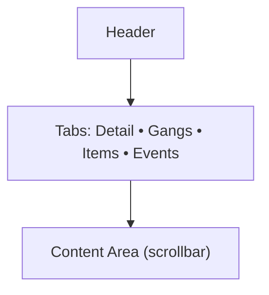
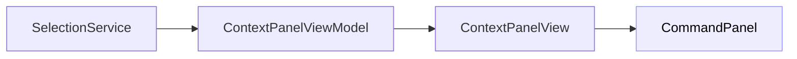

# Chaos Overlords – ContextPanel Specification (Windows Desktop)

Der **ContextPanel** (rechte Seitenleiste – oberer Bereich) zeigt **Informationen** zur aktuellen Auswahl (SectorView/Zelle, Gang, Item) und stellt sekundäre Navigation bereit (Tabs).

---

## 1) Zweck
- **Lesen/Verstehen** des aktuellen Kontexts (Site, Owner, Status, Effekte, Log).
- **Drill‑down** in Details ohne Kontextwechsel vom Hauptfenster.
- **Quelle** für Daten, die Aktionen im CommandPanel kontextualisieren.

---

## 2) Aufbau & Layout
- Position: **rechts**, Breite ~30 % (min 480 px, max 640 px), scroll-/virtualisierbar.
- Struktur:
  - **Header:** Titel (Site/Gang/Item) · Untertitel (Koordinaten/Typ) · Mini‑Badges (Owner, Influence, Status).
  - **Tabs:** *Detail* · *Gangs* · *Items* · *Events* · (*Finance* optional).
  - **Content Area:** dynamisch/scrollbar, sectionbasiert (Cards/Listen).
  - **Footer (optional):** Sekundäre Filter/Zeitraum.

---

## 3) Tab‑Inhalte (Default)
- **Detail:** Site‑Daten (Owner, Influence %, Defenses, Income, Effects); Mini‑KPIs.
- **Gangs:** Gangs vor Ort + Kurzstatus (klick → Details im Panel, keine Modals).
- **Items:** Items an der Site / im lokalen Lager (klick → Kurzinfo).
- **Events:** Lokaler Feed (lazy load, Filter nach Typ/Zeitraum).
- **Finance (optional):** KPIs zur Site (Umsatz, Kosten, Trend), Vollansicht via TopBar.

---

## 4) Interaktionen
| Interaktion | Verhalten | Ergebnis |
|---|---|---|
| Auswahl ändert sich (Map/Content) | Panel lädt neuen Kontext | Tabs/Content aktualisieren |
| Klick auf Entity in Tab | Setzt „aktive Entity“ | CommandPanel erhält erweiterte Aktionen |
| Hover über Badges | Tooltip mit Details | Keine Navigation |
| Scroll | Virtuelle Listen/Cards | Performance stabil |
| Tastatur: Tab/Shift+Tab | Fokusnavigation | Barrierefreiheit |

---

## 5) Datenfluss

- *SelectionService* liefert **aktuelle Auswahl** (Sector/Gang/Item).
- *ContextPanelViewModel* aggregiert Site/Gang/Item/Finance/Events aus GameState.
- **Aktive Entity** im Panel erweitert die **Aktionsmenge** im CommandPanel.

---

## 6) Zustände
| Zustand | Darstellung |
|---|---|
| Loading | Skeleton‑Cards/Spinner |
| Empty | Friendly‑State („Keine Auswahl“) |
| Limited Intel | Ausgegraute Felder + Hinweis |
| Error | Inline‑Banner + Retry |

---

## 7) Regeln & Validierung
- Tabs nur anzeigen, wenn Datenquelle vorhanden (z. B. *Items* bei Lager/Market).
- „Aktive Entity“ (z. B. ausgewählte Gang in *Gangs*) überschreibt die allgemeine Site‑Selektion für Aktionsfreigabe.
- Keine modalen Dialoge; Details bleiben im Panel (Drill‑down Cards).

---

## 8) Accessibility
- Heading‑Struktur pro Tab (H2/H3), ARIA‑Tabs für Reiter.
- Live‑Regionen für Event‑Updates im *Events*‑Tab.
- Kontraste ≥ WCAG AA, Fokus‑Indikatoren.

---

## 9) Implementierungsartefakte (Bezeichner)
- **View:** `CO.ContextPanelView`
- **VM:** `CO.ContextPanelViewModel`
- **Tabs:** `ContextTab.Detail|Gangs|Items|Events|Finance`
- **Events:** `ContextPanel.ActiveEntityChanged(entityRef)`

---

© 2025 Chaos Overlords UI/UX – ContextPanel Specification
