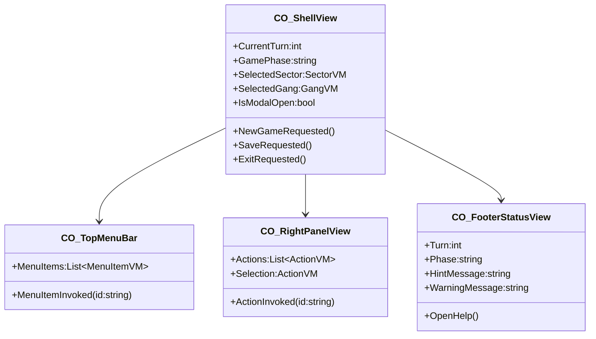
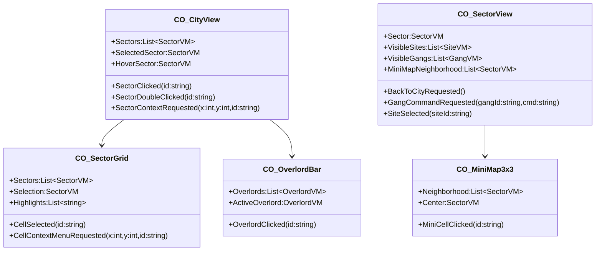
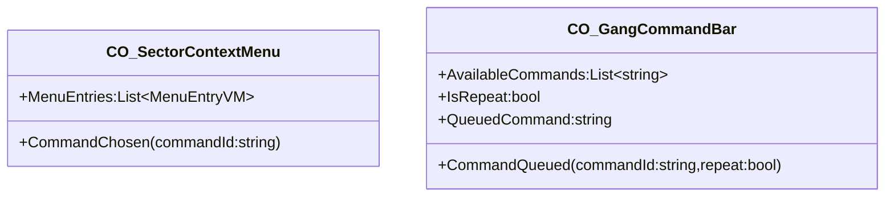
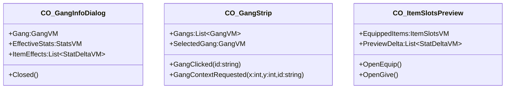
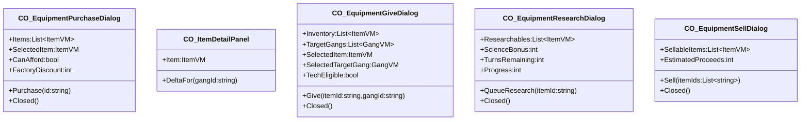
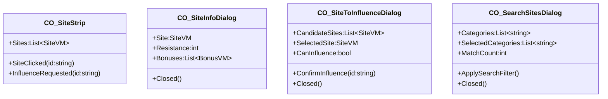
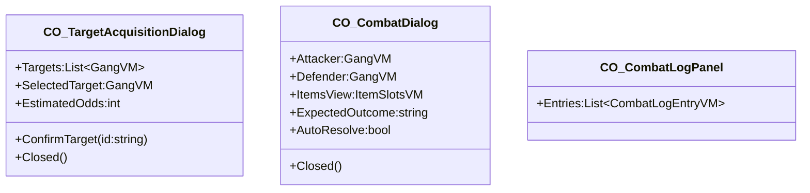
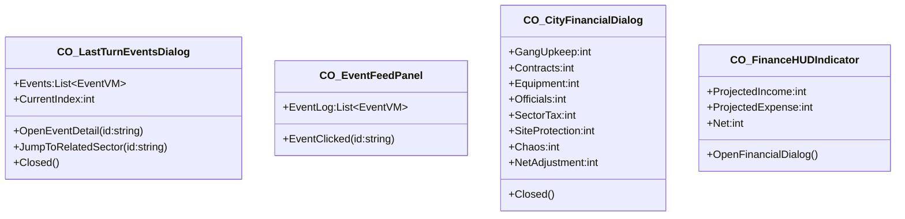
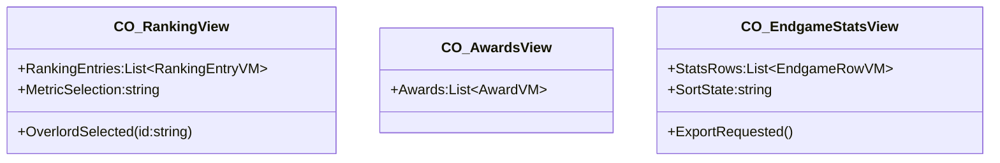
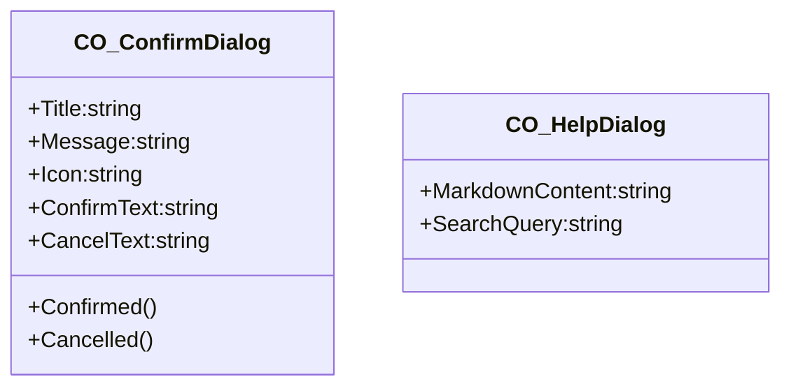

# chaosoverlord.uiux.controls.mermaid.md

Dieses Dokument enthält **Mermaid-ClassDiagram Outlines** für alle geplanten Avalonia-Controls.
Die Notation verwendet einfache Typen/Listen und listet **Bindings** als Felder sowie **Outputs** als Methoden.

---

## 0) Shell & Layout

---

## 1) Map & Navigation

---

## 2) Kontext & Befehle

---

## 3) Gangs & Infos

---

## 4) Items & Forschung

---

## 5) Sites & Einfluss

---

## 6) Kampf

---

## 7) Events & Finance

---

## 8) Endgame & Ranking

---

## 9) Dialog Infrastruktur

