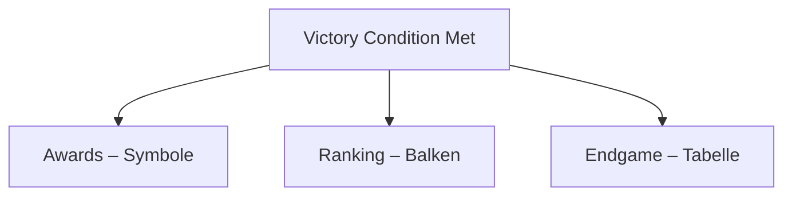

# chaosoverlord.uiux.endgame.md

## 📌 Thema: Endgame (Rankings, Awards, Statistiken)

---

## 1) Beobachtungen aus den Screenshots

### 1.1 Rankings
- Balkendiagramm mit Overlord-Portraits (Zwischenstand oder Ende).

### 1.2 Awards
- Liste der Spieler (Player #1, Torg, Razor, Redd, Eclypse, Rock), Symbole:
  - Faust (Combat), Totenkopf (Eliminations), Dollar (Wealth).

### 1.3 Endgame Stats
- Tabelle u. a. mit Cash Earned, Cash Spent, Damage Inflicted, Casualties, Overthrows.

---

## 2) Abgleich mit Manual
- **Victory Conditions:** Elimination, Control, Score.
- **Rankings:** basieren auf Acceptance/Score/Cash/Support (Manual).
- **Stats:** allgemeine Endstatistiken; Screens zeigen zusätzliche Metriken.

---

## 3) Unstimmigkeiten UI ↔ Manual
1) **Ranking-Kriterien** – Symbole ohne Legende.
2) **Stats-Umfang** – UI detaillierter als Manual.
3) **Siegerbegründung** – UI zeigt Resultat, nicht „warum“ (z. B. 51 % Control).

---

## 4) UX-Kommentare
- **Transparenz** begrenzt (fehlende Legenden/Begründungen).
- **Visuell stark**, aber analytisch schwach.
- **Keine Interaktion** (Sortieren/Filtern).

---

## 5) Lösungsvorschläge (Redesign)
1) **Explizite Begründung** der Siegbedingung.
2) **Symbol-Legende** einblenden.
3) **Mehr Analyse** (Verlaufskurven, sortierbare Tabelle).
4) **Export** als Log/CSV.

---

## 6) Skizze (Mermaid)

