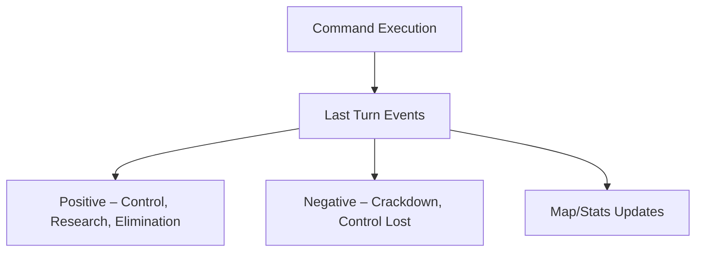

# chaosoverlord.uiux.events.md

## 📌 Thema: Events (Last Turn Events & Game Feedback)

---

## 1) Beobachtungen aus den Screenshots

### 1.1 Event-Popups
- Großes Popup mit Grafik, Text, „OK“.
- Beispiele: Sector Control Attained/Lost, Factory – Site Cooperation Achieved, Research Completed, Overlord Eliminated, Police Crackdown.

### 1.2 Event-Arten
- **Positiv:** Sector Control gewonnen, Site Cooperation, Research Completed, Overlord Eliminated.
- **Negativ:** Sector Control Lost, Police Crackdown.

### 1.3 Kontext
- Events erscheinen am Turn-Ende; kein Eingriff, nur Bestätigung.
- Map/Stats ändern sich, aber Verknüpfung ist nicht interaktiv.

---

## 2) Abgleich mit Manual

- **Turn Structure:** Events berichten Ergebnisse von Commands (Combat, Influence, Research, Finance etc.).
- **Bedeutungen:** Sector Control (3 Sites), Police Crackdown (Negativ-Event), Research Completed (Item freigeschaltet), Overlord Eliminated (alle Gangs 0 Force).

---

## 3) Unstimmigkeiten UI ↔ Manual

1) **Granularität** – Manual liefert Mechanik/Details; UI nur Schlagzeilen.
2) **Map-Verknüpfung** – Event ist nicht klickbar zur betroffenen Zelle.
3) **Forschungsfeedback** – Zwischenstände fehlen, nur „Completed“.

---

## 4) UX-Kommentare
- **Flow-Unterbrechung** durch Vollbild-Popups.
- **Informationsverlust** (fehlende Zahlen).
- **Starke Atmosphäre**, aber Nützlichkeit eingeschränkt.

---

## 5) Lösungsvorschläge (Redesign)

1) **Event-Feed** statt Popups (nicht-blockierend; Major-Events als Modal).
2) **Direkte Verlinkung**: Klick auf Event → springt zu Map-Sektor.
3) **Mehr Details**: „Katana unlocked (+3 Combat, Tech 5)“.
4) **Timeline-Logbuch**: scrollbare Historie.

---

## 6) Skizze (Mermaid)

