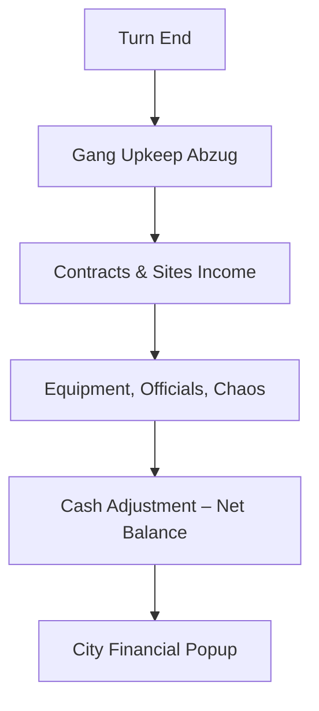

# chaosoverlord.uiux.finance.md

## 📌 Thema: Finanzen (City Financial & Cashflow)

---

## 1) Beobachtungen aus den Screenshots

### 1.1 City Financial Overlay
- Popup „CITY FINANCIAL“ (Tabelle)
  - Gang Upkeep, Contracts, Equipment, City Officials, Sector Tax, Site Protection, Chaos, Cash Adjustment.
- Buttons: OK/Cancel.

### 1.2 Einnahmen/Ausgaben
- **Einnahmen:** Contracts, Sites (Corporate Towers), Sector Control.
- **Ausgaben:** Upkeep, Equipment, Officials, Chaos.
- Netto am Turn-Ende als „Cash Adjustment“.

### 1.3 Sichtbarkeit
- Finanzdaten nur im Overlay; keine HUD-Vorschau.

---

## 2) Abgleich mit Manual
- Turn-Ende: Upkeep → Income → Expenses → Adjustment.
- Sites beeinflussen Kosten/Income (Factory, Corporate Tower, …).
- Negativer Cashflow kann gefährlich werden (Eliminationsrisiko durch Zahlungsunfähigkeit).

---

## 3) Unstimmigkeiten UI ↔ Manual
1) **Detailtiefe** – UI zeigt Summen, nicht Quellen-Drilldown.
2) **Warnungen** – keine Risiko-Alerts für negativen Cashflow.
3) **Zugänglichkeit** – Overlay muss aktiv geöffnet werden.

---

## 4) UX-Kommentare
- **Überblick schwer** ohne Detailaufschlüsselung.
- **Klickintensiv** für regelmäßige Kontrolle.
- **Kein Frühwarnsystem** bei drohendem Bankrott.

---

## 5) Lösungsvorschläge (Redesign)
1) **HUD-Indikator** „+/- Income“ mit Erwartungswert für nächsten Turn.
2) **Drilldown** je Posten (z. B. Contracts auflisten).
3) **Warnsystem** (Icon/Popup) bei < 0.
4) **Visualisierung** (Balken/Timeline).

---

## 6) Skizze (Mermaid)

