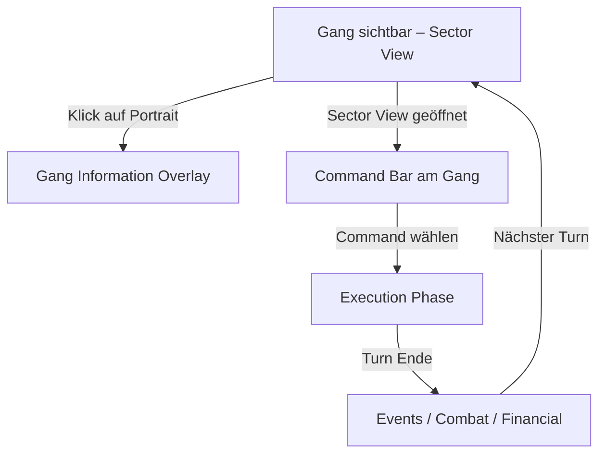

# chaosoverlord.uiux.gangs.md

## Zweck
Dokumentiert **Gang-Ansichten**, **Stats**, **Command-Zuweisung** und **Interaktionsfluss**. Abgleich mit Manual/FAQ inkl. Unstimmigkeiten und Lösungsvorschlägen.

---

## 1) Beobachtungen aus den Screenshots

### 1.1 Gang Information Overlay
- Overlay „GANG INFORMATION“ mit:
  - **Portrait**, **Name**, **Flavor-Text**.
  - **Force**, **Upkeep**, **Tech Level**.
  - **Statistics:** Combat, Defense, Stealth, Detect.
  - **Command Skills:** Chaos, Control, Heal, Influence, Research.
  - **Combat Skills:** Strength, Blade, Ranged, Fighting, Martial Arts.
  - **OK**-Button.
- Items verändern sichtbare Werte (Vor/Nach-Ausrüstung).

### 1.2 Commands via Command Bar / Right Panel
- Befehle werden über die **Command Bar** direkt am Gang oder über **Right Panel**-Buttons ausgelöst (keine Kontextmenüs).
- „Influence“ sichtbar, teils ausgegraut (Bedingungen), konsistente Tooltips.

### 1.3 Gang-Zustände
- Mehrere Gangs im Sektor mit eigenem **Command-Status**.
- Popups nach Command-Wahl: **Movement**, **Target Acquisition**, **Combat**.

---

## 2) Abgleich mit Manual/FAQ (Kurzfassung)

- **Force/Upkeep/Tech:** Force 0 → Elimination; Upkeep pro Turn; Tech Level limitiert Equip/Research.
- **Stats & Skills:** Statistics und Command Skills modifizieren Aktionen; Combat Skills interagieren mit Waffentypen.
- **Items:** kumulative Mods, inkl. negativer Effekte (z. B. Armor senkt Stealth).
- **Hiring & Limits:** mehrere Hiring-Optionen pro Turn; Duplikate möglich (unterschiedliche Datenstände nennen 70+ bis 90 Gangs).
- **Command Bar:** Manual beschreibt Bedienung über die **Bar** (Single/Double Green Arrow) in der Sector View.

---

## 3) Unstimmigkeiten UI ↔ Manual

1) **Command-Eingabeweg**
- Manual priorisiert **Command Bar**; Projekt folgt dem Manual (keine Kontextmenüs).

2) **Terminologie: Influence vs. Search**
- Manual kennt **Influence**; Screens zusätzlich **Search Sites** (funktional verwandt, aber nicht identisch).
- → Begriffsnähe erzeugt Verwechslungsgefahr.

3) **Sichtbarkeit/Tooltips**
- Manual erklärt Detect/Stealth-Logik; UI ohne Tooltips/Legende – hohe Lernkurve.

4) **Gang-Anzahl**
- Unterschiedliche Quellen nennen 70+ bzw. 90 Gangs – Datenstand variiert.

---

## 4) UX-Folgerungen (dokumentiert)

- **Kognitive Last:** Ein Kanal für Befehle (Command Bar/Right Panel) reduziert Komplexität.
- **Flow-Brüche:** Wechsel zur Sector View für Bar-Nutzung; Kontextmenü wirkt global.
- **Feedback:** Item-Effekte sichtbar, aber **Delta** nicht ausgewiesen.

---

## 5) Lösungsvorschläge (Redesign-Ideen)

1) **Synchrones Command-System**
   - Kontextmenü und Command Bar schreiben denselben Status; sichtbares Echo in beiden.

2) **Begriffsklärung**
   - „Search“ → „Scan“; „Influence“ bleibt Übernahme (klar getrennte Aktionen).

3) **Tooltips**
   - Hover für Stats/Skills/Icons (Kurzdefinition + Quelle: Item/Site).

4) **Delta-Anzeige bei Equip**
   - Nebenwert mit +X/−Y farbig markieren.

---

## 6) Interaktionsfluss (Mermaid)

