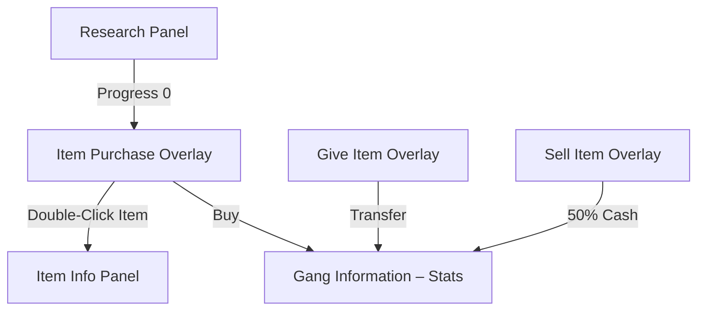

# chaosoverlord.uiux.items.md

## 📌 Thema: Items (Equip, Give, Research, Sell)

---

## 1) Beobachtungen aus den Screenshots

### 1.1 Item Purchase
- Overlay „EQUIPMENT TO PURCHASE“
  - Kategorien: Armor, Weapons, Miscellaneous.
  - Liste verfügbarer Items (z. B. Leathers, Shock Pads, Pistole, Sword).
  - Buttons: OK / Cancel.
- **Item Information Panel**:
  - Name, Typ (Weapon/Armor/Misc), Beschreibung, Kosten, Tech Level, Modifikatoren.
  - Beispiel: *Shock Pads* (Armor) – schwacher Schutz, kaum Bullet/Blade-Stop.

### 1.2 Item Give
- Overlay „EQUIPMENT TO GIVE“
  - Links: Inventar.
  - Rechts: Ziel-Gangs mit Slots (Weapon, Armor, Misc).
  - Transfer per Klick.

### 1.3 Item Effects
- Wertänderungen sichtbar (z. B. Shadow Ninjas: Combat 7→10, Stealth 13→15 mit Sword).
- Items beeinflussen **Stats** und **Skills** kumulativ.

### 1.4 Item Research
- Overlay „EQUIPMENT TO RESEARCH“
  - Item-Liste (Riot Gear, Flak Jacket, Kevlar Vest, Body Armor, Camouflage Suit …).
  - Fortschritt zählt auf 0 → Item freigeschaltet.

### 1.5 Item Sell
- Overlay „EQUIPMENT TO SELL“ (im Manual beschrieben, Screens punktuell).
- Verkauf bringt i. d. R. ~50 % der Kosten (abgerundet).

---

## 2) Abgleich mit Manual

- **Slots:** 1× Weapon, 1× Armor, 1× Misc pro Gang.
- **Tech Level:** Gate für Equip/Research.
- **Kosten/Research:** jedes Item mit Research- und Fabrication-Costs.
- **Commands:** Equip, Give, Sell, Research öffnen jeweilige Overlays.
- **Site-Abhängigkeit:** Forschung benötigt passende Sites/Control.

---

## 3) Unstimmigkeiten UI ↔ Manual

1) **Delta-Anzeige**
- Manual: kumulative Modifikatoren.
- UI: zeigt Zielwerte, **nicht** die Differenz → Vergleich nötig.

2) **Terminologie**
- „Search Sites“ (Scan) vs. „Research“ (Forschung) → ähnlich klingend, aber verschieden.

3) **Restriktionen**
- Tech-Level-Bedingungen sind teils nur implizit erkennbar (dimmen/grauen).

---

## 4) UX-Kommentare
- **Verstreute Workflows:** Buy/Info/Give/Research/Sell in separaten Popups.
- **Viel Klickarbeit**, keine Drag&Drop-Vergabe.
- **Forschung abstrakt:** kaum Visualisierung.

---

## 5) Lösungsvorschläge (Redesign)

1) **Delta-Infos** direkt im Overlay (+X/−Y farbig).
2) **Unified Inventory Panel** mit Tabs Buy/Give/Sell/Research.
3) **Tooltips & Filter** (Typfilter, Tech-Hinweis).
4) **Drag&Drop** von Items auf Gang-Icons.
5) **Research-Progress** als Balken mit Restwert.

---

## 6) Skizze (Mermaid)

