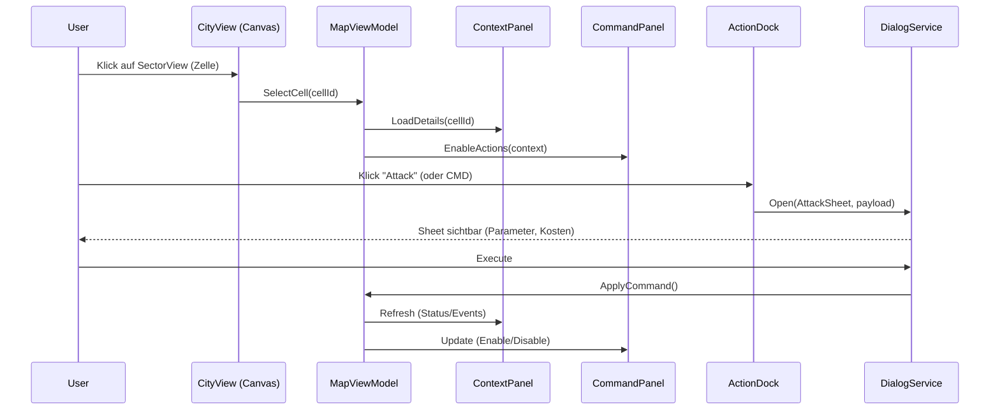

# chaosoverlord.uiux.layout-mapping.md (Windows Desktop – aktualisiert 2025-10-05)

> **Scope:** Nur **Windows Desktop (Landscape)**. Keine Mobile/Tablet-Varianten.  
> **Terminologie:** *CellView* heißt jetzt **SectorView** (eine einzelne Karten-Zelle).  
> **Interaktion:** Keine Kontextmenüs/Modals – Aktionen über **Action Dock** und **Sheets** (DialogService).

---

## 1) Desktop-Zonen (IDs D1–D4) • Controls/Views • Inhalte

| ID | Zone | View/Control | Kerninhalt | Größe/Richtwerte | Hinweise |
|---:|------|--------------|------------|------------------|---------|
| **D1** | **Top Bar** | `CO.TopBarView` | Runde, Spieler, Cash, Alerts; Quick-Access: Finance, Gangs, Warehouse, Research, Settings | H: 56–64 px | Immer sichtbar; Badges/Shortcuts; öffnet Overlays (DialogService). |
| **D2** | **Canvas** | `CO.CityView` + `CO.SectorGrid` + `CO.SectorView` | Karte, Zoom/Pan, **SectorView**-Selektion, Gang-Tokens, Status-Badges | Restfläche; min 1024×768 | 60 FPS Ziel; Hit-Testing pro SectorView (Zelle). |
| **D3** | **Right Panel – Context** | `CO.ContextPanelView` | Tabs: Detail · Gangs · Items · Events · (Finance opt.) | B: ~30 % (min 480 px, max 640 px) | Scroll/Virtualized; zeigt **Informationen** zur Auswahl. |
| **D4** | **Right Panel – Commands** | `CO.CommandPanelView` | Gruppen: Control (Attack/Influence) · Movement · Economy · Misc | Anteil von D3, unter Context | Buttons mit Icon+Label, Tooltips (Regelgründe). |
| **(Bottom)** | **Action Dock** | `CO.ActionDock` + `CO.GangCommandBar` | Primärkommandos (Attack, Influence, Move, Hire, Buy/Sell, Research) | H: ≥96 px | Spiegelt wichtigste Aktionen des CommandPanels; Keyboard 1–6. |

> **Zusammenhang:**  
> Canvas (D2) wählt **SectorView** → Context (D3 oben) zeigt Daten → Commands (D3 unten) & Dock aktivieren passende Aktionen → DialogService zeigt Sheet.

---

## 2) Alt → Neu (Ablösung Win95-Konventionen)

| Alt (Win95) | Problem | Neu (Desktop) | Trigger | Ergebnis |
|-------------|---------|---------------|---------|----------|
| Rechtsklick-Kontextmenüs (Attack/Influence/…) | Versteckt, inkonsistent | **Action Dock** + **CommandPanel** | Klick Dock/Command | Öffnet Sheet (z. B. `AttackSheet`) |
| Modale Dialoge (Combat/Finance/Settings) | Blockierend | **Overlays/Sheets** via DialogService | TopBar/Command/Dock | Nicht-blockierend; Close/Abort-Logik einheitlich |
| Gemischte Info-/Aktionsleisten | Orientierung leidet | **Rechtes Panel getrennt:** Infos **oben**, Aktionen **unten** | SectorSelect | Klares Mentalmodell |

---

## 3) Ereignisfluss (Klick → Info → Aktion → Execute)

---

## 4) Größen & Layoutregeln

- **Top Bar:** 56–64 px, sticky.  
- **Right Panel (Context+Commands):** 30 % Breite (min 480 px, max 640 px).  
- **Action Dock:** ≥96 px, Buttons ≥48×48 px, Labels immer sichtbar.  
- **Canvas:** Restfläche; Zoom (Wheel), Pan (Drag), DblClick = Focus on Sector.  
- **Farben/Lesbarkeit:** Kontraste ≥ WCAG AA; Fokus-Ringe; Tooltips mit Klartext.

---

## 5) Enablement & Validierung (Auszug, Command/Action)

| Aktion | Enable-Bedingung | Öffnet Sheet | Post-Execute |
|--------|------------------|--------------|--------------|
| **Attack** | Eigene Gang selektiert & Ziel feindlich | `AttackSheet` | Combat-Event + Status „Contested“ |
| **Influence** | Site sichtbar & Ressourcen ausreichend | `InfluenceSheet` | Influence-Bar aktualisiert |
| **Move** | Eigene Gang selektiert | `MoveSheet` | Pfad-Hinweis kurz anzeigen |
| **Hire** | Gang-Slot frei & Ressourcen | `HireSheet` | Gangs-Tab refresh |
| **Buy/Sell** | Site = Market/Lager | `PurchaseSheet`/`SellSheet` | Items/Economy refresh |
| **Research** | Lab vorhanden oder global | `ResearchSheet` | Progress-Badge |

> Regeln/Tooltips liefert `CO.ActionRuleEngine` (Reason, CostPreview, Cooldown-Hinweise).

---

## 6) Referenzen (verbundene Spezifikationen)

- **SectorView (Zelle):** `chaosoverlord.uiux.cellview.md`  
- **MapView:** `chaosoverlord.uiux.mapview.md`  
- **ContentView:** `chaosoverlord.uiux.contentview.md` + `chaosoverlord.uiux.content.matrix.md`  
- **TopBar:** `chaosoverlord.uiux.topbar.md`  
- **ContextPanel:** `chaosoverlord.uiux.contextpanel.md`  
- **CommandPanel:** `chaosoverlord.uiux.commandpanel.md`  
- **DialogService (Allgemein):** `chaosoverlord.uiux.dialogservice.general.md`  
- **Popup-Matrix:** `chaosoverlord.uiux.popups.matrix.md`

---

© 2025 Chaos Overlords UI/UX – Desktop Layout Mapping
