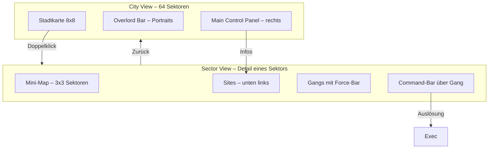

# chaosoverlord.uiux.map.md

## 📌 Thema: Karten- und Sektoransicht (City View / Sector View)

### 1. Beobachtungen aus den Screenshots

#### City View – Hauptkarte
- **Raster 8×8 Sektoren** (64 Felder).
- **Farbcodierung:** jeder Overlord hat eigene Farbe.
- **Symbole:**
  - 🟢 = eigene Gang
  - 🔴 = feindliche Gang
  - ❓ = eigene Gang ohne Befehl
  - 🏛 = Site-Symbol (z. B. Factory, Science Center, Hospital)
  - ⬢⬢ = szenario-relevante Sektoren (zwei graue Polygone)
- **Overlord-Bar:** oben Portraits der Overlords mit Status („WAIT“ etc.).
- **Main Control Panel (rechts):** Buttons für Events, City, Finance, Gangs, Ranking, Done. Aktionen werden hier oder über die Gang-Command-Bar ausgelöst.
- **Navigation:**
  - Mausklick auf Sektor → Markierung (weißes Kästchen).
  - Doppelklick → Wechsel in Sector View.
  - Pfeiltasten (laut Manual) → sektorweise bewegen.

#### Sector View – Detailansicht
- **Darstellung:** Großbild eines Sektors.
- **Sites:** unten links als Gebäudesymbole.
- **Mini-Map:** 9-Felder-Matrix zur Orientierung.
- **Gangs:** Portraits mit Force-Bar (grün/rot).
- **Command-Bar:** Pfeilsymbole oberhalb der Gangs → Befehlswahl.
- **Navigation:** zurück zur City View mit grünem Pfeil unten links.

---

### 2. Abgleich mit Manual (City View / Sector View)

- ✅ **Stimmt überein:**
  - 64 Sektoren, Farbcodierung.
  - Mini-Map (3×3).
  - Overlord-Bar mit Portraits.
  - Site-Icons in Sektoren.
  - Force-Balken für Gangs.
  - „WAIT“-Anzeige in Overlord-Bar.

- ⚠️ **Unstimmigkeiten / Präzisierungen:**
  1) **Commands – Eingabeweg**
     - Manual betont eine **Command Bar** in der Sector View.
     - In den Screenshots werden Commands überwiegend via **Rechtsklick-Kontextmenü** gesetzt (z. B. Attack, Influence, Move).
     - „Influence“ ist im Kontextmenü sichtbar (z. B. Screenshot 10), teils ausgegraut.
  2) **Site-Interaktion**
     - Manual: *Influence* (Übernahme) nur bei Sektorkontrolle.
     - UI: zusätzlich Popup **„Search Sites“**, das eher *Erkundung/Scan* impliziert.
  3) **Symbolik**
     - Manual beschreibt genaue Sichtbarkeiten (Detect vs. Stealth).
     - UI hat keine Legende/Tooltips → hohe Lernkurve.

---

### 3. UX-Kommentare (Dokumentation, keine Wertung)
- **Richtlinie:** Aktionen werden nicht über Kontextmenüs vergeben. Stattdessen Command Bar (am Gang) oder Right Panel Buttons.
- **Lernkurve:** Symbolik ohne In-Game-Erklärung schwer verständlich.
- **Kontextwechsel:** City ↔ Sector View erfordert mehrere Klicks; kaum Hover-Hilfen.

---

### 4. Skizze (Mermaid)

