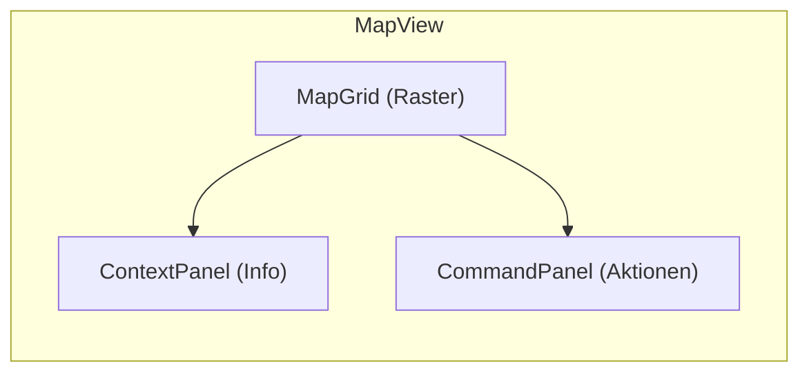
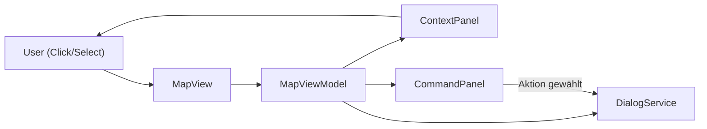
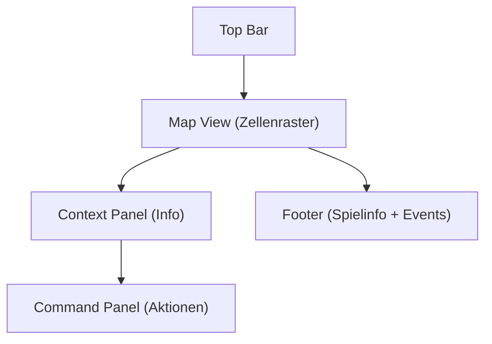

# Chaos Overlords – MapView Specification

Der **MapView** ist das zentrale Spielfeld-UI-Element von *Chaos Overlords*.  
Er bildet die Spielkarte in einer rasterförmigen Struktur ab, in der jede **Zelle (Tile)** eine Site oder ein Gebäude repräsentiert.  
Der Benutzer interagiert mit diesen Zellen per Klick oder Auswahl, wodurch im rechten Bereich (Context Panel + Command Panel) zusätzliche Informationen und Aktionen angezeigt werden.

---

## 🧩 1️⃣ Aufbau des MapView

### Hauptkomponenten

| Bereich | Beschreibung |
|----------|---------------|
| **MapGrid** | Rasterdarstellung der Stadt / des Bezirks. Jede Zelle stellt eine Site dar. |
| **ContextPanel (rechts oben)** | Zeigt detaillierte Informationen zur aktuell ausgewählten Zelle an. |
| **CommandPanel (rechts unten)** | Zeigt kontextabhängige Aktionen an (abhängig von der Art der Site und der dort befindlichen Gangs). |
| **Footer (unten)** | Zeigt allgemeinen Spielstatus: aktiver Spieler, Runde, letzte Ereignisse. |

### Logische Struktur

---

## 🖱️ 2️⃣ Interaktion: Klick auf eine Map-Zelle

### Ereignisfluss

1. Benutzer klickt auf eine Zelle im MapGrid.  
2. MapView erkennt die Zelle (Koordinaten / ID).  
3. ViewModel ermittelt:
   - Site-Informationen (Besitzer, Einfluss, Verteidigung, Einkünfte etc.)
   - Zugehörige Gangs
   - mögliche Aktionen
4. ContextPanel und CommandPanel werden aktualisiert.

---

## 🧭 3️⃣ Anzeigen im ContextPanel (rechts oben)

Der **ContextPanel** dient der **Informationsanzeige** zur ausgewählten Site.

| Kategorie | Beispielhafte Datenfelder |
|------------|----------------------------|
| **Site Info** | Name, Typ (z. B. Factory, Office, Slum), Koordinaten |
| **Owner / Control** | Aktueller Besitzer (Gang oder Con), Einflusswert |
| **Defenses** | Sicherheitsstufe, Verteidigungsboni, aktive Wachen |
| **Production / Income** | Ertrag, laufende Einnahmen, Spezialboni |
| **Modifiers / Effects** | Aktive Effekte (z. B. Sabotage, Influence, Bonuses) |
| **Status Icons** | Symbole für Blockiert, Umkämpft, Neutral, Geschützt |
| **Intel Level** | Sichtbarkeit der Daten (abhängig von Scouting / Influence) |

**Interaktion innerhalb des ContextPanels:**
- Klick auf Gang- oder Con-Namen → öffnet **GangOverview** oder **ConInfoPopup**.  
- Klick auf Statussymbol → öffnet Erklärungstooltip.  
- Hover über Effekte → zeigt Dauer / Quelle.

---

## ⚔️ 4️⃣ Anzeigen im CommandPanel (rechts unten)

Der **CommandPanel** zeigt alle **kontextabhängigen Aktionen**, die auf der aktuell ausgewählten Zelle möglich sind.  
Diese Aktionen unterscheiden sich je nach Zellentyp, Besitzer und Situation.

| Kategorie | Aktion | Beschreibung |
|------------|---------|--------------|
| **Angriff / Kontrolle** | `Attack` | Startet einen Angriff auf die Site. Öffnet `AttackSheet`. |
|  | `Influence` | Versucht, den Einfluss auf die Site zu erhöhen. Öffnet `InfluenceSheet`. |
|  | `Sabotage` | Beschädigt Verteidigung oder Einkünfte (späterer Feature-Slot). |
| **Bewegung / Interaktion** | `Move Gang` | Bewegt eine Gang auf diese Zelle. Öffnet `MoveSheet`. |
|  | `Deploy` | Stationiert eine Gang auf der Site (wenn leer). |
|  | `Withdraw` | Zieht eigene Gang ab. |
| **Wirtschaft** | `Buy` | Öffnet `PurchaseSheet`, wenn Site Markt oder Shop ist. |
|  | `Sell` | Öffnet `SellSheet`, wenn Site Lager- oder Handelsgebäude ist. |
|  | `Research` | Öffnet `ResearchSheet`, wenn Site Laborfunktion hat. |
| **Aufklärung / Kommunikation** | `Spy` | Zeigt fremde Aktivitäten. |
|  | `Communicate` | Kontaktaufnahme zu neutraler Fraktion (eventuell KI-Dialog). |

**Interaktionsprinzipien:**
- Aktionen werden **nicht direkt ausgeführt**, sondern öffnen ein **PopupSheet**.  
- Der CommandPanel enthält pro Aktion einen Button mit Symbol + Text.  
- Buttons sind deaktiviert, wenn die Aktion aktuell nicht verfügbar ist (z. B. keine Gang vor Ort).

---

## 🧍‍♂️ 5️⃣ Darstellung der Gangs im Content-Bereich (mittleres Panel / Layer)

Wenn eine Zelle Gangs enthält, werden diese im **MapView-Layer** oder im **ContextPanel-Tab "Gangs"** dargestellt.

| Anzeige | Beschreibung |
|----------|---------------|
| **GangIcons auf der Karte** | Kleine Avatare mit Farbe der Gang, Anzahl oder Symbol. |
| **Hover / Tooltip** | Zeigt Name, Stärke, Ausrüstung. |
| **Klick auf GangIcon** | Öffnet **GangDetailsPopup** (ähnlich GangOverview, aber fokussiert auf eine Einheit). |
| **Mehrere Gangs in einer Zelle** | Stack-Symbol mit Anzahl; Klick öffnet Auswahlmenü. |

**Gang-bezogene Aktionen (nur sichtbar, wenn eigene Gang aktiv):**
- `Attack`, `Move`, `Defend`, `Use Item`, `Leave Site`.

---

## 🧮 6️⃣ Zusammengefasste Zustände / Darstellungen im MapView

| Zustand | Beschreibung | UI-Verhalten |
|----------|---------------|--------------|
| **Keine Auswahl** | Keine Zelle aktiv | ContextPanel leer, CommandPanel deaktiviert |
| **Zelle ausgewählt** | Benutzer klickt auf Zelle | Panels zeigen Site-Informationen und Aktionen |
| **Mehrere Gangs auf Zelle** | Stack geöffnet | Auswahlmenü oder Gang-List im ContextPanel |
| **Aktion aktiv** | z. B. Attack-Sheet geöffnet | Panels grau hinterlegt (deaktiviert, Fokus auf Popup) |
| **Fremdgebiet** | Site gehört anderem Con | Nur Informationsanzeige, keine Aktionen |

---

## 🔁 7️⃣ Informations- und Datenfluss

- **MapViewModel** ist die zentrale Steuerungsebene.  
- Bei Auswahl einer Zelle werden ContextPanel und CommandPanel aktualisiert.  
- Jede Aktion aus dem CommandPanel wird an den DialogService delegiert.

---

## 🧩 8️⃣ Beispielhafte Darstellung (UI-Zonen)

---

## 9️⃣ Zusammenfassung

- Der **MapView** ist das interaktive Zentrum der Spielfläche.  
- Klick auf Zelle → lädt Daten zur Site, zeigt Gangs, ermöglicht Aktionen.  
- **ContextPanel** = Informationsanzeige, **CommandPanel** = verfügbare Befehle.  
- Alle Interaktionen folgen dem Grundmuster:  
  **Klick → Information → mögliche Aktion → Popup-Ausführung → Rückmeldung.**  
- Die **UI bleibt nicht modal** – Panels bleiben sichtbar, Popups erscheinen als Overlays.  

---

© 2025 Chaos Overlords UI/UX – MapView Interaction Specification
