# chaosoverlord.uiux.menus.md

## 📌 Thema: Menüs & Meta-UI (Start, Optionen, Multiplayer, Save/Load)

---

## 1) Beobachtungen aus den Screenshots
- **Title Screen:** Windows-95 Menüleiste (File, Edit, Options, Comm, Help).
- Keine Submenü-Screens vorhanden.

---

## 2) Abgleich mit Manual

### 2.1 File
- New Game, Load, Save, Exit (klassisch).

### 2.2 Edit
- Nicht dokumentiert (vermutlich Standard-Shortcuts/Optionen).

### 2.3 Options
- Sound/Animation/Difficulty; evtl. Szenario-Setup/Siegbedingungen.

### 2.4 Comm (Multiplayer)
- TCP/IP, LAN, Modem; Host/Join-Dialoge.

### 2.5 Help
- In-Game-Hilfe/FAQ (optional).

---

## 3) Unstimmigkeiten UI ↔ Manual
1) **Scenario Setup** – UI nicht gezeigt, Manual beschreibt es.
2) **Difficulty Settings** – erwähnt, aber keine Screens.
3) **Multiplayer Setup** – vorhanden laut Manual, ohne Screens.

---

## 4) UX-Kommentare
- **Look & Feel**: Win95-Dialoge brechen das In-Game-Thema.
- **Trennung**: Meta-UI vs. Spiel-UI wenig integriert.

---

## 5) Lösungsvorschläge (Redesign)
1) **Game Lobby** für Szenario/Difficulty/Multiplayer in konsistentem Stil.
2) **Branding** statt Menüleiste (Themen-Buttons).
3) **Save/Load** mit Vorschaubildern.
4) **Multiplayer-Lobby** mit Portraits/Status.

---

## 6) Skizze (Mermaid)

```mermaid
flowchart TD
    Title[Title Screen]
    File[File – New, Load, Save, Exit]
    Options[Options – Difficulty, Sound, Scenario Setup]
    Comm[Comm – Multiplayer Setup]
    Help[Help – Manual/FAQ]

    Title --> File
    Title --> Options
    Title --> Comm
    Title --> Help
```

