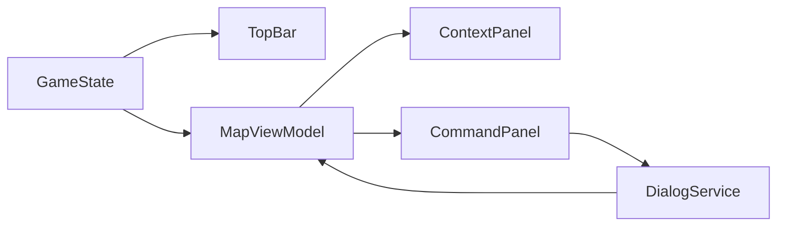

# chaosoverlord.uiux.newlayouts.md (Windows Desktop – aktualisiert 2025-10-05)

> Modernes Desktop-Layout für Chaos Overlords. Keine Modals/Kontextmenüs.  
> Aktionen über **Action Dock** & **CommandPanel**; Informationen über **ContextPanel**; Zellen heißen **SectorView**.

---

## 1) Layout-Übersicht (1920×1080 Basis)

```mermaid
flowchart LR
  TB[Top Bar]
  CV[Canvas (City/Sector – SectorView Zellen)]
  RP[Right Panel: Context (oben) + Commands (unten)]
  AD[Action Dock]

  TB --- CV
  CV --- RP
  CV --- AD
```

### Rollen
- **Top Bar:** Globale KPIs, Quick-Access (Finance, Gangs, Warehouse, Research, Settings).  
- **Canvas:** Karte mit **SectorView**-Zellen, Selektion & Status.  
- **Right Panel:** **Context** (Infos) **oben**, **Commands** (Aktionen) **unten**.  
- **Action Dock:** stets sichtbare Primäraktionen (Keyboard 1–6).

---

## 2) Größen & Verhalten

| Bereich | Richtwert | Hinweise |
|--------|----------|----------|
| Top Bar | 56–64 px | Sticky, Badges, Shortcuts |
| Right Panel | 30 % Breite (min 480, max 640 px) | Scroll/Virtualized; geteilte Bereiche |
| Action Dock | ≥96 px Höhe | Icons+Labels; Tooltips (Regelgrund) |
| Canvas | Restfläche | Zoom/Pan, 60 FPS Ziel |

Collapsed-Modus (optional ab <1600 px): Right Panel einklappbar, öffnet bei Hover/Klick.

---

## 3) Interaktionsprinzipien

- **Selektion in Canvas** steuert Right Panel & Dock (Kontextualisierung).  
- **Aktionen** starten **immer** über Dock/CommandPanel und öffnen **Sheets** (DialogService).  
- **Busy**- und **Fehler**-Feedback **inline** im Sheet; UI bleibt bedienbar.  
- **Keyboard:** 1–6 (Dock), ESC (Abort/Close), F1 (Help), F5 (Quick Save).

---

## 4) Standard-Sheets (Auszug, konsistent mit Popup-Matrix)

| Sheet | Primary | Secondary | Close/Abort | Ergebnis |
|------|---------|-----------|-------------|----------|
| AttackSheet | Execute Attack | Preview | Abort | Combat-Event, Status „Contested“ |
| InfluenceSheet | Apply Influence | Show Cost | Abort | Influence-Bar Update |
| MoveSheet | Confirm Move | Highlight Path | Abort | Pfad-Hinweis |
| HireSheet | Hire Gang | Show Cost | Abort | Gangs-Refresh |
| PurchaseSheet | Confirm Purchase | Compare | Close | Items/Economy Refresh |
| SellSheet | Sell Item | Show Price | Close | Items/Economy Refresh |
| ResearchSheet | Start Research | Show Info | Abort | Progress-Badge |

---

## 5) Zustände & Accessibility

- **Fokus-Ringe** (Canvas-Zelle, Buttons).  
- **Live-Regions** für Events/Income.  
- **Kontraste** ≥ WCAG AA.  
- **Tooltips** mit Klartextgründen (Enable/Disable).

Zustände (global/Topbar/Panel): **Normal**, **Processing (Turn)**, **Alert**, **Error/Warning**, **Paused**.

---

## 6) Datenfluss (vereinfacht)



---

## 7) Implementierungsartefakte (Bezeichner)

- **Views:** `TopBarView`, `CityView`, `SectorView`, `ContextPanelView`, `CommandPanelView`, `ActionDock`.  
- **Services:** `DialogService`, `SelectionService`, `ActionRuleEngine`.  
- **Specs:** siehe `layout-mapping.md`, `mapview.md`, `cellview.md` (SectorView), `contentview.md`, `topbar.md`, `contextpanel.md`, `commandpanel.md`, `dialogservice.general.md`, `popups.matrix.md`.

---

© 2025 Chaos Overlords UI/UX – New Desktop Layout
