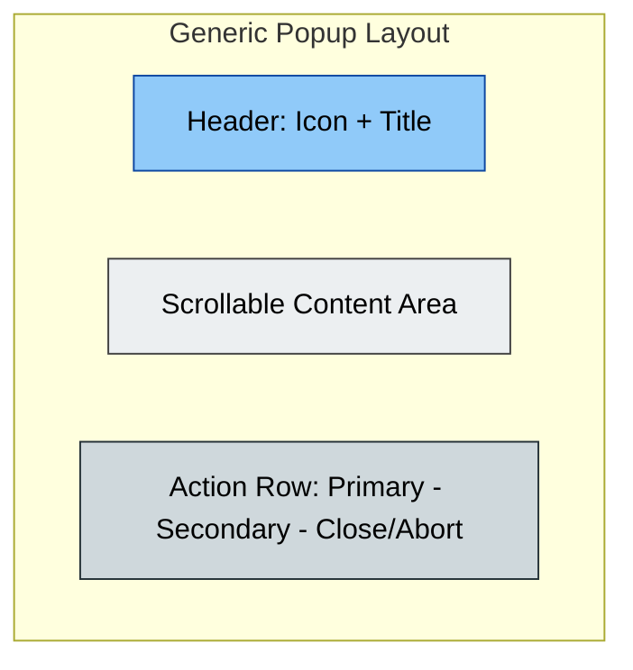
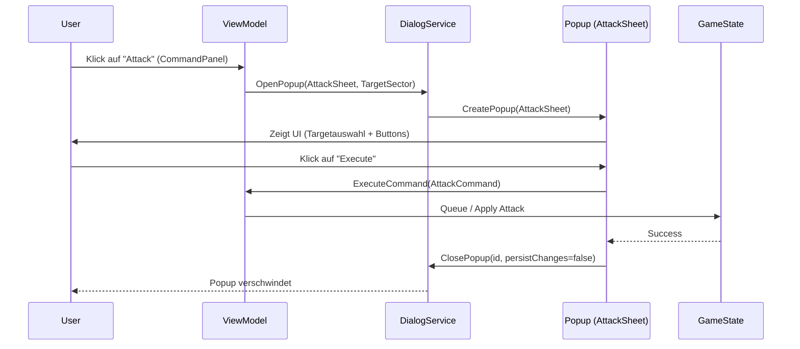

# Chaos Overlords – Popup & Dialog Specification

> Grundlage für den zukünftigen `DialogService` / `PopupService` in Avalonia / AXAML.
> Diese Dokumentation beschreibt Aufbau, Verhalten, Öffnungslogik und Schließvorgänge
> sämtlicher Popup-/Sheet-Dialoge im Spiel „Chaos Overlords“.

---

## 🧩 Popup-System Übersicht

Popups dienen im Spiel zur Anzeige zusätzlicher Informationen oder zur Ausführung von Aktionen.
Es gibt drei Hauptkategorien:

| Kategorie | Zweck | Beispiel |
|------------|--------|-----------|
| **Informational** | Anzeige von Daten / Status / History | Events, Finance, Gangs, Warehouse |
| **Interactive** | Benutzeraktionen mit Parametern | Attack, Influence, Research, Purchase |
| **System** | Steuerung des Spiels selbst | Settings, Confirm, Scenario, Quit |

Alle Popups verwenden dasselbe Grundlayout (siehe unten).

---

## Use Cases
**Öffnen**
Auslöser:
- Ein Button-Click oder Command im Hauptfenster (z. B. Top Bar, Command Panel, Context Menu)
- Der DialogService entscheidet anhand des Aufrufkontexts (CommandType, Payload), welches Popup geladen wird.

Ablauf:
- ViewModel sendet "OpenPopup" mit Typ und optionalem Parameter (z. B. AttackTarget, FinanceData)
- DialogService erstellt PopupView aus Factory (z. B. `PopupFactory.Create<T>()`)
- PopupView wird als Overlay auf dem MainView angezeigt

**Execute**
Auslöser:
- Klick auf Primary / Secondary Action

Verhalten:
- Aktion wird ausgeführt oder in Command Queue eingereiht (z. B. "AttackCommand", "ResearchCommand").
- Nach erfolgreichem Execute:
  - Popup wird automatisch geschlossen
  - GameState wird aktualisiert
  - Optional: Event-Message (z. B. "Research started") im EventFeed

**Schließen**
Varianten:
a) **Close-Button:** Popup wird geschlossen, eingegebene Daten persistiert (z. B. Einstellungen, Texteingaben).
b) **Abort:** Popup wird geschlossen, keine Aktion, kein Speichern.
c) **Auto-Close:** Nach erfolgreichem Execute.

Verhalten:
- DialogService ruft `ClosePopup(id, persistChanges: bool)` auf
- Falls persistChanges == true → Update GameState
- Andernfalls → verwerfe lokale Änderungen

---

## 🟠 Kategorie A – Informations-Popups

| ID | Name | Größe (px) | Farbe | Primary | Secondary | Close/Abort | Trigger / Öffnen | Beschreibung |
|----|------|-------------|--------|-----------|--------------|---------------|----------------|----------------|
| **P1** | EventsPopup | 640×480 | 🟠 Orange | Mark as Read | Scroll to Oldest | Close | Klick auf letzten Event im Footer | Zeigt 5–10 letzte Spielereignisse mit Scrollliste |
| **P2** | FinanceOverview | 960×600 | 🟢 Grün | Export Report | Filter Turn | Close | Klick auf 💰 in Top Bar | Einnahmen, Ausgaben, Upkeep, Trends |
| **P3** | GangOverview | 960×600 | 🔵 Blau | Manage Gang | View Stats | Close | Klick auf 🧑‍🎤 in Top Bar | Übersicht aller Gangs, Status, Ausrüstung |
| **P4** | WarehousePopup | 960×600 | 🟣 Violett | Sell Item | Transfer | Close | Klick auf 📦 in Top Bar | Zeigt Lagerbestand und Transaktionen |
| **P13** | PlayerInfoPopup | 640×480 | ⚫ Grau | – | – | Close | Klick auf Portrait im Footer | Zeigt Spielerprofil, ggf. Avataränderung |
| **P14** | EventFeedExpanded | 960×600 | 🟠 Orange | Filter Events | Export | Close | Klick auf „Show More“ in EventsPopup | Vollständige Event-Historie |
| **P15** | HelpPopup | 720×540 | 🟣 Lila | Open Manual | Show Controls | Close | Klick auf ❓ | Kurzhilfe & Steuerungsreferenz |

---

## 🔴 Kategorie B – Interaktions-Popups

| ID | Name | Größe (px) | Farbe | Primary | Secondary | Close/Abort | Trigger / Öffnen | Beschreibung |
|----|------|-------------|--------|-----------|--------------|---------------|----------------|----------------|
| **P5** | AttackSheet | 720×540 | 🔴 Rot | Execute Attack | Preview | Abort | Button „Attack“ im Command Panel | Zielauswahl, Siegchancenanzeige |
| **P6** | InfluenceSheet | 720×540 | 🟡 Gelb | Apply Influence | Show Cost | Abort | Button „Influence“ im Command Panel | Einfluss auf Site ausüben |
| **P7** | ResearchSheet | 720×540 | ⚪ Weiß | Start Research | Show Info | Abort | Button „Research“ im Command Panel | Neues Item erforschen |
| **P8** | PurchaseSheet | 720×540 | ⚫ Grau | Confirm Purchase | Compare | Close | Button „Buy“ im Command Panel | Kauf eines Items |
| **P9** | GiveSheet | 720×540 | 🟤 Braun | Give Item | Select Target | Abort | Button „Give“ | Übergabe von Item an Gang |
| **P10** | SellSheet | 720×540 | 🟤 Braun | Sell Item | Show Price | Close | Button „Sell“ | Verkauf von Item aus Lager |
| **P11** | HireSheet | 720×540 | 🟣 Violett | Hire Gang | Show Cost | Abort | Button „Hire“ | Neue Gang anwerben |
| **P12** | MoveSheet | 720×540 | 🔵 Blau | Confirm Move | Highlight Target | Abort | Button „Move“ | Gang auf neue Position verlegen |

---

## ⚙️ Kategorie C – System-Popups

| ID | Name | Größe (px) | Farbe | Primary | Secondary | Close/Abort | Trigger / Öffnen | Beschreibung |
|----|------|-------------|--------|-----------|--------------|---------------|----------------|----------------|
| **P16** | SettingsPopup | 1200×720 | ⚙️ Grau | Save Settings | Reset | Close | Klick auf ⚙️ | Optionen, Audio, Anzeige, Difficulty |
| **P17** | ScenarioPopup | 1200×720 | 🟢 Grün | Start Scenario | Preview | Abort | Klick im SettingsPopup | Auswahl neuer Kampagnen |
| **P18** | QuitConfirmPopup | 640×320 | 🔴 Rot | Confirm Quit | Save & Quit | Abort | Klick auf Quit | Rückfrage bei Spielende |
| **P19** | ConfirmPopup | 480×320 | ⚫ Grau | Yes | No | Abort | Intern / API | generische Bestätigung für alle Aktionen |
| **P20** | ErrorPopup | 480×320 | 🔴 Rot | Retry | Copy Log | Close | Intern / Engine | Fehlermeldung mit Debug-Text |

---

## 🧱 Popup Layout (generisch)

## 🧱 Popup Sequenz Beispiel (Attack)

