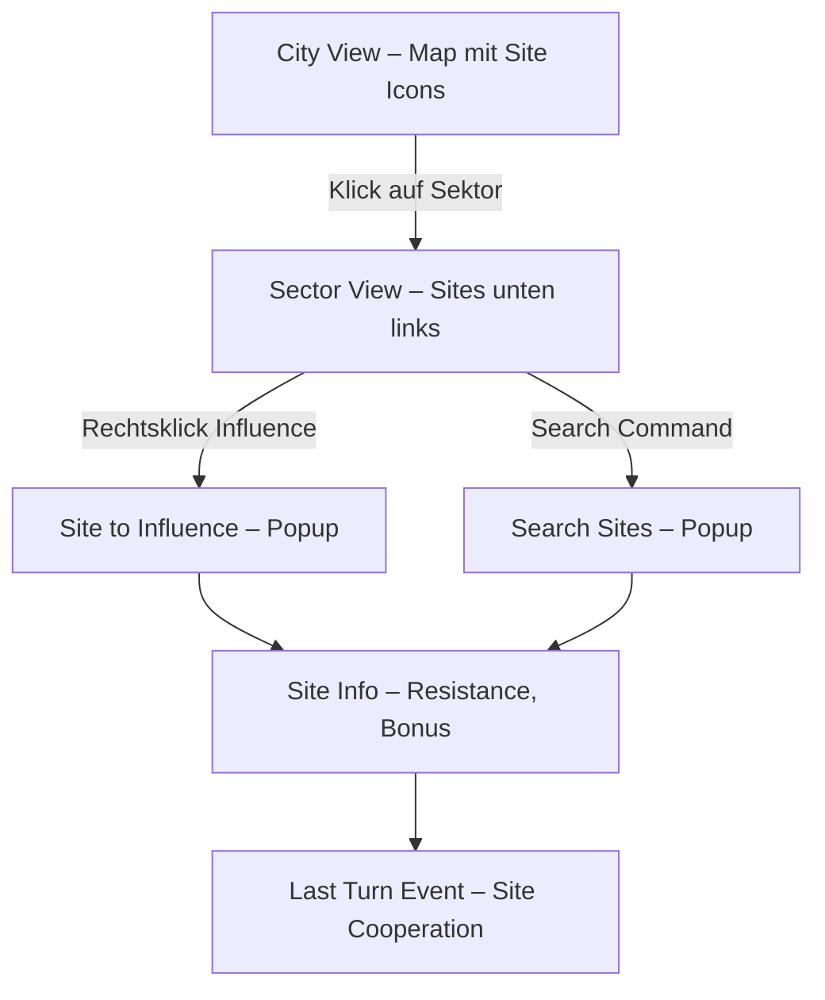

# chaosoverlord.uiux.sites.md

## 📌 Thema: Sites (Gebäude im Spiel)

---

## 1) Beobachtungen aus den Screenshots

### 1.1 Site-Darstellung
- **City View:** kleine Icons innerhalb der Sektoren.
- **Sector View:** Sites unten links als Gebäude-Symbole.
- **Overlays:**
  - „Search Sites“ (Liste: Gym, Museum, Corporate Tower, Research Lab, Hospital …).
  - „Site to Influence“ (Zielwahl, OK/Cancel).
  - „Site Information“ (Name, Resistance, Bonus).

### 1.2 Site-Boni – Beispiele
- **Factory:** Resistance 10, Equipment Discount 30 %.
- **Science Center:** Resistance 8, Research Tech +8.
- **Corporate Tower:** Cash-Bonus (Manual).
- **Hospital/Museum:** Heal bzw. Tolerance/Support (Manual).

### 1.3 Events & Feedback
- „Factory – Site Cooperation Achieved“ (Influence erfolgreich).
- „Sector Control Lost“ setzt Sites zurück.

---

## 2) Abgleich mit Manual

- Jede Zelle enthält **eine Site**; 3 Sites pro Sektor.
- **Influence** reduziert **Resistance**; bei 0 ist Site beeinflusst.
- **Influence nur in kontrollierten Sektoren**.
- Verlust der Sektorkontrolle setzt Resistance auf Max.
- Boni: Factory (Equip-Kosten↓), Science Center (Research↑), Corporate Tower (Cash↑), Hospital/Museum (Support/Tolerance).

---

## 3) Unstimmigkeiten UI ↔ Manual

1) **Begrifflichkeiten**
- Manual: *Influence* als Übernahme.
- UI: zusätzlich „Search Sites“ → suggeriert Erkundung/Scan.
- → Begriffsverwirrung möglich.

2) **Sichtbarkeit**
- Resistance/Boni nur im Site-Info-Fenster, nicht direkt auf der Map.

3) **Feedback**
- Kein fortlaufender Resistance-Fortschritt auf der Karte; erst Event meldet Erfolg.

---

## 4) UX-Kommentare
- **Informationszugang** schwer (mehrere Klicks nötig).
- **Doppelte Begriffswelt** (Search vs. Influence).
- **Abhängigkeit von Kontrolle** wenig explizit kommuniziert (graue Menüoption).

---

## 5) Lösungsvorschläge (Redesign)

1) **Terminologie bereinigen**
   - „Search Sites“ → **„Scan Sites“**; „Influence“ bleibt Übernahme.
2) **Transparenz**
   - Hover auf Site: Resistance + Bonus in Kurzform.
3) **Kartenfeedback**
   - Marker/Balken für Resistance-Fortschritt direkt am Icon.
4) **Kontext-Integration**
   - Grau hinterlegte „Influence“-Option mit Tooltip „Requires Control“.

---

## 6) Skizze (Mermaid)

