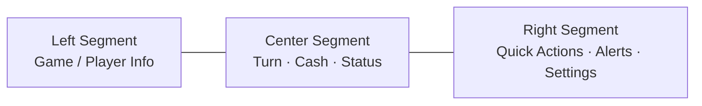
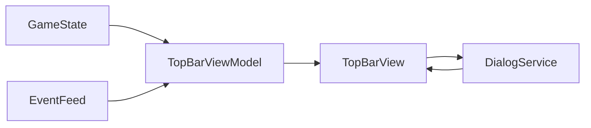
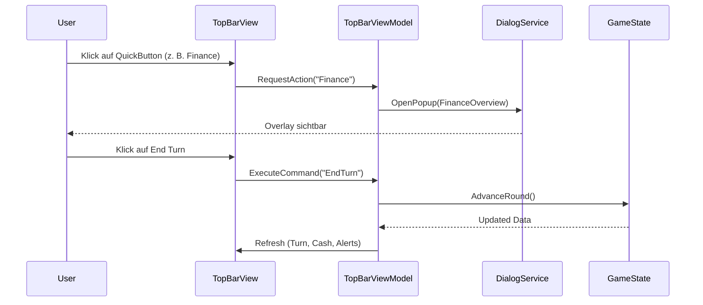

# Chaos Overlords – TopBar Specification (Windows Desktop)

Die **TopBar** ist die obere Hauptleiste der Benutzeroberfläche und dient als globale Status- und Schnellzugriffsleiste.  
Sie bleibt in allen Ansichten sichtbar und ist integraler Bestandteil der Desktop-UI-Struktur.

---

## 🧩 1️⃣ Zweck und Aufgaben

Die TopBar erfüllt drei Hauptfunktionen:

1. **Statusanzeige:** Zeigt den globalen Spielzustand (Runde, Spieler, Cash, Alerts).  
2. **Navigation & Shortcuts:** Zugriff auf zentrale Overviews (Finance, Gangs, Warehouse, Research, Settings).  
3. **Benutzerfeedback:** Hinweise auf neue Ereignisse, Warnungen, laufende Prozesse.

---

## 🧱 2️⃣ Aufbau der TopBar

### Strukturübersicht

| Bereich | Beschreibung | Beispielinhalt |
|----------|---------------|----------------|
| **Left Segment** | Spiel- und Spielerinfos | Spielname · Aktiver Spieler · Profil-Icon |
| **Center Segment** | Globale Spielindikatoren | Runde X · Cash · Reputation · Active Effects |
| **Right Segment** | Schnellzugriffe & Tools | Gangs · Finance · Warehouse · Research · ⚙️ Settings |

---

## ⚙️ 3️⃣ Komponenten und Layout

| Element | Typ | Beschreibung |
|----------|-----|--------------|
| **Logo / Titelbereich** | Text/Icon | „Chaos Overlords“ (links oben) |
| **Turn Indicator** | Label + Icon | „Turn 05 / 20“ oder „Round 12“ |
| **Cash Display** | Zahl + Währungssymbol | z. B. 💰 1.245 Cr |
| **Reputation / Influence** | Balken oder Zahl | z. B. Einfluss 42 % |
| **Alerts** | Badge-Icon (🔔) | Ungelesene Ereignisse; Klick öffnet EventsPopup |
| **Quick Buttons** | IconButtons mit Label | Gangs · Finance · Warehouse · Research |
| **Settings / System** | Gear-Icon | Öffnet SettingsPopup (Sheet) |
| **Turn Controls** | Buttons | ▶ End Turn, ⏸ Pause (optional) |

---

## 🧭 4️⃣ Interaktionen

| Interaktion | Beschreibung | Ergebnis |
|--------------|---------------|-----------|
| **Klick auf Quick-Button (Finance, Gangs, Warehouse, Research)** | Öffnet entsprechendes Popup/Sheet | Anzeige im Overlay (DialogService) |
| **Klick auf Alert (🔔)** | Öffnet `EventsPopup` (InfoSheet) | Letzte Ereignisse mit Markierung |
| **Klick auf Settings (⚙️)** | Öffnet `SettingsPopup` | Sheet mit Tabs (Audio, Grafik, Gameplay) |
| **Klick auf End Turn (▶)** | Beendet Runde | Zeigt Busy-Indicator, Events aktualisieren |
| **Hover auf Statuswerte** | Tooltip mit Details (z. B. Income Breakdown) | Kein Klick nötig |
| **Keyboard-Shortcuts:** |  | |
| – **F1** | Hilfe/Manual öffnen (`HelpPopup`) | |
| – **F5** | Quick Save | |
| – **1–4** | Direkter Zugriff auf Quick-Buttons | |

---

## 🔄 5️⃣ Datenfluss

### Erklärung
- **TopBarViewModel** bezieht Live-Daten aus `GameState` (Turn, Cash, Influence).  
- **EventFeed** aktualisiert Badge-Anzahl für Alerts.  
- **DialogService** öffnet Sheets/Popups über Klicks in der TopBar.  
- Bidirektionale Bindung: Aktionen aus TopBar beeinflussen GameState (z. B. Turn-Ende).

---

## 🧠 6️⃣ Zustände

| Zustand | Beschreibung | Darstellung |
|----------|---------------|--------------|
| **Normal** | Standardanzeige | Werte aktiv, Buttons enabled |
| **Turn Processing** | Spiel rechnet Runde ab | Center-Segment: Spinner + „Processing…“ |
| **Alert Active** | Neue Ereignisse | 🔔 mit Badge (Zahl) |
| **Error / Warning** | Spielstatus kritisch | Farbwechsel (Gelb/Rot), Tooltip |
| **Paused** | Spiel angehalten | Bläuliche Überlagerung, Buttons deaktiviert |

---

## 💡 7️⃣ Design- und Layoutwerte

| Element | Maße / Verhalten |
|----------|-----------------|
| **Höhe:** | 56–64 px |
| **Padding:** | 12–16 px (innen) |
| **Farbe (Hintergrund):** | #101419 (Dark Gray) |
| **Textfarbe:** | #E0E0E0 (Primär), #9E9E9E (Sekundär) |
| **Highlight:** | Accent-Farbe des Spielers (z. B. Blau, Rot) |
| **Buttongröße:** | ≥ 48×48 px |
| **Icongröße:** | 24 px |
| **Font:** | Orbitron / Eurostile – semibold, 14–16 pt |

---

## 📊 8️⃣ Verbindung zu anderen Views

| Ziel | Beschreibung | Verbindung |
|------|---------------|------------|
| **ContentView** | Dient als Hauptinformationsfläche; TopBar liefert globale Statuskontext | Bidirektional via ViewModel |
| **MapView** | Visuelle Karte; TopBar-Status spiegelt globale Spielphase | GameState → TopBar |
| **DialogService** | Öffnet Popups (Sheets) auf Quick-Button-Events | TopBar → DialogService |
| **Footer (optional)** | Zeigt Events / Turn-Resultate; Alert-Feed synchron | EventFeed |

---

## 🧩 9️⃣ Ereignisfluss (Interaktion → Aktion)

---

## ✅ 10️⃣ Zusammenfassung

- **TopBarView** = konstante, nicht-modale Kontrollleiste.  
- Zeigt globale Werte, bietet Schnellzugriffe, Feedback & Systemsteuerung.  
- Ersetzt alte Menüstrukturen durch direkte Buttons + Overlays.  
- Reaktiv, keyboardfähig, farblich an Con/Spielerstatus gebunden.  
- Verknüpft mit `DialogService`, `GameState`, `EventFeed`.

---

© 2025 Chaos Overlords UI/UX – TopBar Specification (Windows Desktop)
